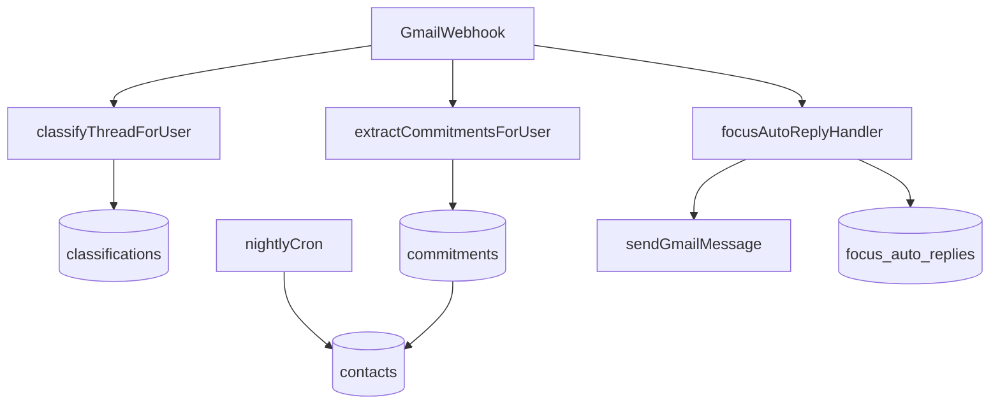

# Actionable Inbox — Plan Document

## Deliverable

Create **[docs/actionable-inbox-plan.md](docs/actionable-inbox-plan.md)** — single source of truth for the pivot from "meeting pipeline" to "actionable email." Structure mirrors [docs/whats-done.md](docs/whats-done.md) (executive summary, phase tables, evidence paths) but forward-looking.

---

## Locked product decisions (from alignment session)

| Decision | Choice |
|----------|--------|
| Positioning | Full pivot — actionable email hero; `M` scheduling moves to second section |
| Commitment extraction | Separate AI pass on every Gmail webhook, parallel to classifier |
| Low confidence (&lt;0.6) | "Possible commitment?" chip on thread — confirm/dismiss before entering views |
| Auto follow-up | 5 business days silence on Waiting For → AI draft queued, **never auto-send** |
| Relationship scope | Top 50 contacts by email volume (90d), rebuilt nightly |
| Focus Mode auto-reply | **Option 2:** one-time auto-reply email per sender during focus windows via existing [`sendGmailMessage`](src/lib/corsair/actions.ts) — not native Gmail vacation API |
| Thread → Action | Linear only at launch; Notion/GitHub "coming soon" in UI + homepage demo |
| Snippets | `//` trigger + user CRUD + 5 seeded templates |
| Send-time optimization | Per-counterparty reply patterns when ≥5 exchanges; business-hours fallback |
| Homepage demo | Fully client-side mock — working keyboard shortcuts, no auth |
| Launch bar | **All 7 features live** before public repositioning |
| Pricing | Show **$15/mo** with Superhuman $30 comparison |

---

## Product thesis (homepage + onboarding copy)

**One-liner:** *Superhuman makes you faster at email. Command Inbox makes your email actually work for you.*

**Hero headline:** *Your inbox is your todo list, whether you like it or not.*

**Target:** Freelancers, consultants, indie hackers at $15/mo.

**Do NOT build:** multi-account, async video, gamification, AI tone sliders.

---

## Architecture overview

**Hook point:** extend [`handleGmailMessageChanged`](src/lib/webhooks/gmail-event.ts) to call commitment extraction + focus auto-reply after existing `classifyThreadForUser`.

**Reuse patterns:**
- Classifier pipeline: [`src/lib/classifier/persist.ts`](src/lib/classifier/persist.ts), [`src/lib/schemas/domain.ts`](src/lib/schemas/domain.ts) (`schedulingIntent` JSON shape)
- AI JSON generation: [`src/lib/ai/generate.ts`](src/lib/ai/generate.ts), Zod at boundaries per workspace rules
- Thread summaries / daily brief: [`src/lib/ai/daily-brief.ts`](src/lib/ai/daily-brief.ts), [`threadSummaries`](src/lib/db/schema.ts)
- Focus blocks: [`/api/inbox/focus-block`](src/app/api/inbox/focus-block/route.ts), [`createCalendarFocusBlock`](src/lib/corsair/actions.ts)
- Send later: [`scheduledSends`](src/lib/db/schema.ts) + [`/api/cron/process-due`](src/app/api/cron/process-due/route.ts)
- Shortcuts: [`src/lib/shortcuts.ts`](src/lib/shortcuts.ts) — add `W`, `B`, `T`
- Homepage: refactor [`src/components/home/landing-page.tsx`](src/components/home/landing-page.tsx)

---

## Database schema (new migration)

Add to [`src/lib/db/schema.ts`](src/lib/db/schema.ts) + `drizzle/0009_*.sql`:

**`commitments`**
- `id`, `userId`, `threadId`, `messageId`
- `direction`: `outbound` | `inbound`
- `text`, `dueDate?`, `counterpartyEmail`
- `status`: `pending_confirm` | `open` | `fulfilled` | `dismissed`
- `confidence`, `extractedAt`

**`contacts`** (rollup, nightly rebuild)
- `userId`, `email`, `displayName`
- `lastContactAt`, `avgResponseHours`, `emailCount30d`
- `warmth`: `cold` | `warm` | `active` | `new`
- `openCommitmentCount`

**`email_snippets`**
- `userId`, `name`, `body`, `variables` (json string[])

**`user_preferences`**
- `batchWindows` (json time strings)
- `focusModeEnabled`, `autoResponderTemplate`
- `followUpDaysDefault` (default 5)

**`external_connections`**
- `provider`: `linear` (v1)
- encrypted `accessToken`, `teamId`, `defaultProjectId`

**`thread_external_tasks`**
- `threadId`, `provider`, `externalTaskId`, `url`

**`focus_auto_replies`** (Option 2 dedup)
- `userId`, `senderEmail`, `sentAt`, `focusWindowId` — max one reply per sender per calendar day during active focus

---

## Feature specs (all 7 required for launch)

### 1. Commitment Tracker (killer)

- **Views:** Commitments (you promised) + Waiting For (`W` key, others promised)
- **Extraction:** New module `src/lib/commitments/extract.ts` — structured JSON via `generateJsonWithProvider`; Zod schema in `src/lib/schemas/domain.ts`
- **Confidence flow:** ≥0.6 → `open`; &lt;0.6 → `pending_confirm` + thread chip "Possible commitment?"
- **Follow-up:** Cron checks Waiting For open items; after 5 business days silence → queue draft via existing [`src/lib/ai/drafts.ts`](src/lib/ai/drafts.ts) pattern (composer review required)
- **APIs:** `GET/POST/PATCH /api/inbox/commitments`
- **UI:** New panels in [`inbox-shell.tsx`](src/components/inbox/inbox-shell.tsx); optional query param `?view=commitments`

### 2. Meeting Pre-Brief (`B`)

- Trigger: next calendar event within 2h, or `B` on thread
- Content: last 3 threads with attendee (Corsair search), open commitments, recent attachments, tone one-liner
- Cache: `meeting_briefs` table or extend `threadSummaries` pattern
- API: `GET /api/inbox/pre-brief?attendeeEmail=&eventId=`
- Component: `src/components/inbox/meeting-pre-brief-panel.tsx`

### 3. Relationship Health (`/people`)

- Route: `src/app/people/page.tsx` + nav link from inbox shell
- Top 50 by volume (90d); warmth rules documented in plan (e.g. no reply 21d + high-priority inbound = cold)
- Alerts: inject into daily brief generation in [`daily-brief.ts`](src/lib/ai/daily-brief.ts)
- API: `GET /api/inbox/contacts`
- Cron: `src/lib/contacts/rebuild.ts` nightly

### 4. Focus Mode + Email Batching

- Settings: batch windows (default 9am / 1pm / 5pm), customizable template
- During focus window:
  - Suppress in-app Pusher toasts ([`use-inbox-realtime.ts`](src/components/inbox/use-inbox-realtime.ts))
  - Create calendar focus blocks (existing API)
  - **Auto-reply (Option 2):** on inbound webhook during focus, if sender not in `focus_auto_replies` for today → send templated reply via `sendGmailMessage` in-thread; log dedup row
- Template default: *"I check email at 9am, 1pm, and 5pm. I'll get back to you soon."*
- API: `GET/PATCH /api/inbox/preferences`, extend focus-block route if needed
- Component: `src/components/inbox/focus-mode-settings.tsx`

### 5. Thread → Action (`T`)

- Linear OAuth in settings; store in `external_connections`
- Modal: AI pre-fill title/description from thread + summary
- Create issue via Linear GraphQL API (`src/lib/integrations/linear.ts`)
- Link stored in `thread_external_tasks`
- API: `POST /api/inbox/export-task`, `GET/POST /api/connect/linear`
- Component: `src/components/inbox/export-task-modal.tsx`
- Notion/GitHub: disabled in modal + homepage demo only

### 6. Smart Snippets (`//`)

- Trigger in [`composer-panel.tsx`](src/components/inbox/composer-panel.tsx): type `//` → cmdk-style fuzzy picker
- Variables: `{{first_name}}`, `{{project_name}}` resolved from thread context
- Seed on first connect: Follow-up, Intro, Invoice, Scheduling, OOO
- API: `GET/POST/PATCH/DELETE /api/inbox/snippets`
- Settings or palette entry for CRUD

### 7. Send-Time Optimization

- Compute reply-time histogram per counterparty from message timestamps in Corsair thread data
- When user opens send-later in composer, suggest slot + tooltip ("Priya usually replies Tue 10am")
- Fallback: next business day 9am local if &lt;5 prior exchanges
- Module: `src/lib/send-time/suggest.ts`; wire into composer send-later UI

---

## Homepage repositioning

Refactor [`landing-page.tsx`](src/components/home/landing-page.tsx):

**Hero:** new headline, subcopy, $15/mo pricing line, CTA unchanged (`/sign-in`)

**New component:** `src/components/home/feature-showcase.tsx`
- 7 tabs: Commitments, Pre-Brief, People, Focus, Export, Snippets, SendTime
- Client mock data in `src/components/home/mock/demo-data.ts`
- Real keyboard handlers (`W`, `B`, `T`, `//`) within focused demo sandbox
- Linear active; Notion/GitHub greyed "Coming soon"

**Keep:** dark section for `M` scheduling workflow (second story, not hero)

**Update:** [`shortcut-reference.tsx`](src/components/home/shortcut-reference.tsx) to include new public shortcuts

**Pricing block:** "$15/mo · vs Superhuman $30"

Design: preserve existing parchment/card system per [design-taste-frontend skill](.agents/skills/design-taste-frontend/SKILL.md) — editorial, not AI-slop defaults.

---

## Implementation phases and timeline

| Phase | Scope | Est. days |
|-------|-------|-----------|
| 0 | Schema migration, Zod schemas, webhook hook skeleton | 4 |
| 1 | Commitment Tracker (extract, views, W, follow-up cron) | 6 |
| 2 | Meeting Pre-Brief (B, cache, panel) | 4 |
| 3 | Relationship Health (/people, cron, brief alerts) | 5 |
| 4 | Focus Mode + Option 2 auto-reply + batch windows | 6 |
| 5 | Linear export (T, OAuth, modal) | 4 |
| 6 | Snippets (//, CRUD, seeds) | 3 |
| 7 | Send-time optimization | 3 |
| 8 | Homepage pivot + FeatureShowcase | 4 |

**Total:** ~39 days (~5–6 weeks). Homepage mock (Phase 8 UI shell) can start in parallel with Phase 1 using static mock data.

**Launch gate:** all phases complete + update [docs/whats-done.md](docs/whats-done.md) + [docs/social-post.md](docs/social-post.md) with new positioning.

---

## New shortcuts (registry)

Add to [`src/lib/shortcuts.ts`](src/lib/shortcuts.ts):

| Key | Action | Context |
|-----|--------|---------|
| `W` | Open Waiting For | global |
| `B` | Meeting pre-brief | thread |
| `T` | Export to Linear | thread |
| `F` | Fulfill commitment | thread (palette + when chip focused) |

---

## Testing strategy

- Zod schema unit tests in `src/lib/__tests__/` for commitment extraction output, snippet variable resolution, send-time suggest
- API route smoke tests for commitments CRUD
- Manual QA checklist in plan doc for focus auto-reply dedup (same sender, same day = one reply only)

---

## Risks and mitigations

| Risk | Mitigation |
|------|------------|
| Auto-reply feels spammy | One per sender per day; in-thread reply; user-editable template; opt-out toggle |
| LLM cost on every webhook | Commitment pass uses last message body only; skip FYI/done lanes heuristically |
| Linear OAuth scope | Document env vars in [docs/deploy.md](docs/deploy.md) |
| All-7 launch scope | Strict phase order; homepage mock parallel to reduce idle time |

---

## Document sections in `docs/actionable-inbox-plan.md`

1. Executive summary + positioning
2. Locked decisions table (above)
3. Architecture diagram + data flow
4. Schema reference
5. Feature specs (1–7) with acceptance criteria
6. Focus Mode Option 2 detail (auto-reply flow diagram)
7. Homepage spec + mock interaction matrix
8. Phase timeline + file touch list
9. Shortcut registry additions
10. Testing + launch checklist
11. Risks
12. Related docs links
