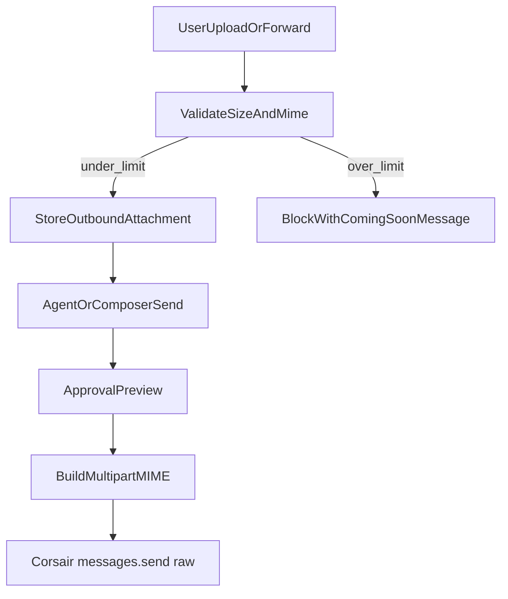
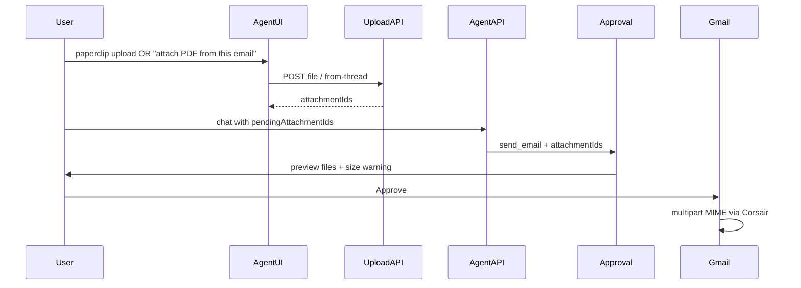

# Native Gmail Attachments (Agent + Composer)

## Locked decisions (grill-me)

| Decision | Choice |
|----------|--------|
| File sources | Chat upload **and** forward from open thread |
| Calendar | **Gmail only v1** — invites unchanged (Meet link) |
| UI surfaces | **Agent chat + composer** |
| Oversize policy | **Block send** + notify; promise future smart handling (no Drive fallback) |
| Sign-out scope | N/A for this feature |

## Current gap

- [`src/lib/gmail/raw-message.ts`](src/lib/gmail/raw-message.ts) builds a single `text/html` MIME body — no `multipart/mixed`.
- [`src/lib/corsair/actions.ts`](src/lib/corsair/actions.ts) `sendGmailMessage` → Corsair `messages.send({ raw })` — correct transport, missing attachment MIME.
- Agent [`send_email`](src/lib/schemas/agent-tools.ts) / [`action-tools.ts`](src/lib/agent/action-tools.ts) has no attachment fields.
- [`ComposerPanel`](src/components/inbox/composer-panel.tsx) and [`sendBodySchema`](src/lib/schemas/api.ts) are body-only.
- Inbound attachment **metadata** exists ([`gmail-parse.ts`](src/lib/corsair/gmail-parse.ts)); no outbound or download-to-forward path.

## Gmail native limits (v1 enforcement)

- **Hard ceiling:** 25 MB total encoded message (Gmail API documented max).
- **App limits (recommended):** max **20 MB** raw bytes per attachment; max **22 MB** combined raw attachment bytes per message (leave headroom for HTML + MIME + base64 overhead).
- **Warn at:** 15 MB combined — yellow badge in approval/composer UI.
- **Reject copy (exact intent):** *"This exceeds Gmail's native attachment limit. Smart large-file handling is coming soon—this agent will compress, split, or route oversized files automatically."*
- **Allowed MIME families:** images (`image/*`), PDF (`application/pdf`), audio/voice (`audio/*`, common voice: `audio/m4a`, `audio/webm`, `audio/mp4`), video (`video/*`) — reject executables (`application/x-msdownload`, etc.).

## Architecture

### 1. Shared attachment module

New files:

- [`src/lib/gmail/attachment-limits.ts`](src/lib/gmail/attachment-limits.ts) — constants, `validateAttachmentSize`, `validateMessageAttachmentTotal`, friendly error messages.
- [`src/lib/gmail/outbound-attachment.ts`](src/lib/gmail/outbound-attachment.ts) — DB read/write, expiry cleanup, fetch bytes for send.
- Extend [`src/lib/gmail/raw-message.ts`](src/lib/gmail/raw-message.ts) → `buildRawEmailWithAttachments({ ...email, attachments: { filename, mimeType, data: Buffer }[] })` using `multipart/mixed` + `base64` Content-Transfer-Encoding per part.

Extend [`sendGmailMessage`](src/lib/corsair/actions.ts) to accept optional `attachments: OutboundAttachment[]` and call the multipart builder.

### 2. Persistence

New migration + Drizzle table `outbound_attachments`:

| Column | Purpose |
|--------|---------|
| `id` | UUID returned to client/agent |
| `user_id` | tenant isolation |
| `filename`, `mime_type`, `size_bytes` | metadata |
| `data` | `bytea` (Postgres) |
| `source` | `upload` \| `thread_forward` |
| `source_message_id`, `source_attachment_id` | optional provenance |
| `expires_at` | TTL 24h; cron or lazy delete on read |

Join table `scheduled_send_attachments` (or JSON column on `scheduled_sends`) for composer undo-window sends with attachments.

### 3. APIs

| Route | Purpose |
|-------|---------|
| `POST /api/inbox/outbound-attachments` | `multipart/form-data` upload → `{ id, filename, sizeBytes, mimeType }` |
| `POST /api/inbox/outbound-attachments/from-thread` | `{ threadId, messageId, attachmentId }` → fetch via Corsair `messages.attachments.get`, store copy, return `id` |
| `DELETE /api/inbox/outbound-attachments/[id]` | Remove before send |

Rate-limit uploads (reuse [`user-rate-limit.ts`](src/lib/api/user-rate-limit.ts) pattern).

### 4. Agent path

- **UI:** Paperclip on [`agent-chat-panel.tsx`](src/components/inbox/agent-chat-panel.tsx) / [`agent-mention-input.tsx`](src/components/inbox/agent-mention-input.tsx); chip list of staged files with remove.
- **Chat API:** Extend [`agentChatBodySchema`](src/lib/schemas/api.ts) with `pendingAttachmentIds: string[]`.
- **System prompt:** [`system-prompt.ts`](src/lib/agent/system-prompt.ts) — list staged files; `send_email` may include `attachmentIds`; forward-from-thread via tool or pre-staged IDs.
- **Tool schema:** `send_email` + `schedule_send` add `attachmentIds: z.array(z.string().uuid()).max(10).optional()`.
- **Execute:** [`action-tools.ts`](src/lib/agent/action-tools.ts) loads bytes, validates totals, calls `sendGmailMessage`.
- **Approval:** [`SendEmailApproval`](src/components/inbox/agent-tool-approval.tsx) — file list, sizes, oversize block (disable Approve), coming-soon banner.

**Thread forward:** Small tool `stage_thread_attachment` OR server auto-exposes open-thread attachments in system prompt context; recommended: explicit tool the agent calls when user says "attach the PDF from this email" → calls `from-thread` API.

### 5. Composer path

- [`ComposerPanel`](src/components/inbox/composer-panel.tsx): paperclip + attachment chips; `onSend(body, attachmentIds)`.
- [`inbox-shell.tsx`](src/components/inbox/inbox-shell.tsx) `handleComposerSend` → pass IDs to [`/api/inbox/send`](src/app/api/inbox/send/route.ts).
- Extend [`sendBodySchema`](src/lib/schemas/api.ts) + [`scheduled-sends.ts`](src/lib/inbox/scheduled-sends.ts) + dispatch path to load attachments at send time.

### 6. Explicitly out of scope (v1)

- Google Drive upload / link-in-body fallback
- Calendar event file attachments
- Agent generating binary files (only user-supplied bytes)
- Inbound attachment download UI in thread view (only forward-to-outbound API)
- Compression / splitting / resumable upload (document as Phase 2 "smart handling")

## Testing

- Unit: multipart MIME structure in `raw-message.test.ts`
- Unit: size validation edge cases (22 MB pass, 23 MB fail)
- Unit: `sendEmailToolInputSchema` with `attachmentIds`
- Smoke: upload → agent approval payload includes filenames (manual QA)

## Docs touch (minimal)

- One paragraph in README agent section: native Gmail attachments, size limit, coming-soon for oversized files.

## Risk notes

- **Vercel body size:** ensure route `export const maxDuration` / body limit config if deploying; 22 MB uploads may need streaming or warn to use smaller files on serverless.
- **Postgres bytea:** acceptable for hackathon; move to object storage if files grow.
- **LLM hallucination:** agent must only use valid `attachmentIds` from staged list — validate server-side that IDs belong to `userId`.
