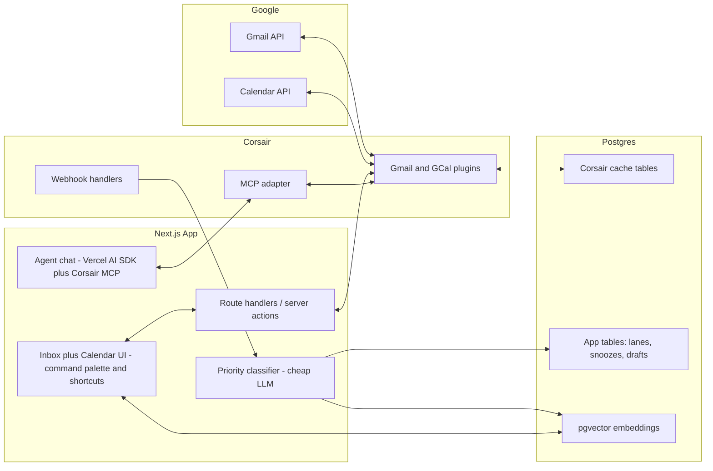

# Command Inbox — Product & Build Plan

## 1. Product Thesis (the YC pitch)

**Problem:** For people whose inbox is really a *meeting pipeline* — founders, recruiters, consultants, agency owners — 60%+ of email work is scheduling coordination: "does Tuesday work?", "sending an invite", "rescheduling", "following up". Gmail and Google Calendar are two disconnected apps, so this loop takes 10–15 clicks per meeting. Superhuman makes email faster but still treats email and calendar as separate worlds.

**Solution:** Command Inbox merges them into one keyboard-driven surface. The core insight: *every email is either a reply, a meeting, or noise.* The app triages your inbox into exactly those lanes (AI-powered), and makes the email→meeting conversion a single keystroke.

**Hero workflow (the demo moment):** Open an email thread → press `M` → AI reads the thread, extracts proposed times/attendees, shows your calendar availability inline next to the email → press Enter → invite sent + AI-drafted confirmation reply queued. ~3 seconds vs ~2 minutes in Gmail+GCal.

**Target audience & benefit (primary persona first):**
- **Consultants/freelancers (primary):** the affordable Superhuman — their inbox is their meeting pipeline; protect focus time; agent handles "book me with X next week" via chat.
- Founders/sales (secondary): inbox becomes a pipeline view; never lose a warm lead to scheduling friction.
- Recruiters (secondary): batch-schedule candidate calls; AI triage surfaces candidate replies above newsletters.
- Quantified benefit: ~10 clicks → 1 keystroke per meeting; triage time cut by AI priority lanes; search across all history in <1s instead of Gmail's slow remote search.

## 2. Feature Set (mapped to the 100-point rubric)

- **Corsair Integration (20):** All Gmail + GCal traffic goes through Corsair plugins (`@corsair-dev/gmail`, `@corsair-dev/googlecalendar`). Corsair webhooks for realtime sync, Corsair's local DB cache as source of truth, Corsair MCP for the agent. Zero direct Google API calls.
- **Gmail Workflow (15):** Triage lanes (Reply / Schedule / FYI / Done), split-second archive/snooze, AI smart-drafts with tone presets, send-later, thread → meeting conversion, advanced search UI over Corsair search API.
- **Calendar Workflow (15):** Week strip always visible beside inbox, inline availability picker inside email threads, one-key invite send/update/cancel, "defrag my week" view, RSVP status chips on threads that have meetings attached.
- **Productivity UX (15):** Full command palette (`Cmd/Ctrl+K`), Superhuman-style single-key shortcuts (`E` archive, `R` reply, `M` meeting, `J/K` navigate, `/` search), zero-mouse demo possible, optimistic UI, dark theme, beautiful empty states. Cross-platform input strategy (see section 3.5).
- **AI & MCP (15):** (a) Agent chat panel using Corsair MCP — "Send a calendar invite to friend@corsair.dev at 9 AM next Thursday, and email him saying I look forward to it" works end-to-end with permission/approval UI. (b) Cheap-LLM priority classifier on every inbound webhook (subject+body → priority + lane + extracted scheduling intent). (c) AI reply drafts grounded in thread context.
- **Engineering Quality (10):** Typed end-to-end (TypeScript, Drizzle, zod), clean service layer, webhook signature verification via Corsair, migrations, env validation, no hardcoded data.
- **Demo & Docs (10):** YC-style video script (below), README with architecture diagram, Corsair features list, bonus tasks list.

## 3. Architecture

**Stack:** Next.js 15 (App Router), Postgres (Neon or local + Neon for deploy), Drizzle ORM, `corsair` + `@corsair-dev/gmail` + `@corsair-dev/googlecalendar` + `@corsair-dev/mcp`, Vercel AI SDK for agent chat, Gemini Flash for agent + classification and `text-embedding-004` for embeddings, Better Auth (Google sign-in, multi-tenant), Pusher/Ably for realtime push, pgvector extension, Tailwind + shadcn/ui, ngrok for local webhook testing, deploy on Vercel.

**Key data flow:** New email arrives → Google → Corsair webhook → single `/api/webhooks` endpoint → Corsair verifies + caches → our hook classifies priority/lane + embeds into pgvector → realtime push to UI via Pusher/Ably (5s local-DB polling as fallback). Reads never hit Google directly; everything is <1s from Postgres.

## 3.5 Cross-Platform Input & Keybinding Strategy

We are selling convenience — input must feel native on every device, with zero collisions with OS/browser shortcuts.

**Detection:** Detect platform via `navigator` once on load; render the correct modifier glyphs everywhere (`⌘` on Mac, `Ctrl` on Windows/Linux). All shortcut hints in the UI, palette, and cheat-sheet auto-adapt — never show `Cmd` to a Windows user.

**Keybinding rules (collision-safe):**
- Single-key shortcuts (`J`, `K`, `E`, `R`, `M`, `/`, `?`, `X`, `S`) only fire when no input/textarea/contenteditable is focused — they can never collide with OS shortcuts because they carry no modifier. This is the Gmail/Superhuman/Linear model and works identically on Windows and Mac.
- Modifier shortcuts use `Mod` (= `Cmd` on Mac, `Ctrl` on Windows): `Mod+K` palette, `Mod+Enter` send, `Mod+Shift+F` advanced search. Avoid known browser collisions: never bind `Mod+W`, `Mod+T`, `Mod+N`, `Mod+L`, `Mod+D`, `Ctrl+Shift+K` (Firefox console). `Mod+K` is safe and conventional (Slack/Linear/Notion precedent — browsers allow preventDefault on it).
- Escape always closes the topmost layer (palette → modal → panel), Enter always confirms primary action.
- Implementation: a single typed shortcut registry (one source of truth) consumed by the key handler, the command palette, the cheat-sheet overlay (`?`), and tooltips. Library: `react-hotkeys-hook` or a small custom hook with scope support (global / list / thread / composer scopes).

**Android / touch (no keyboard):** Responsive PWA layout. Keyboard verbs map to touch equivalents: swipe right = archive, swipe left = snooze, long-press = multi-select, a floating action button opens the same command palette (palette is the universal interface — type-to-act replaces keystrokes on mobile). Bottom tab bar: Inbox / Calendar / Agent chat. Installable PWA manifest so it feels like an app on Android.

## 3.6 UI / Design System (the product IS the UI)

- **Layout (desktop):** 3-pane — triage lanes + thread list (left), thread view (center), week-strip calendar + agent chat (right, collapsible). Everything reachable in ≤1 keystroke or ≤1 tap.
- **Visual language:** shadcn/ui + Tailwind, dense-but-calm typography (Inter/Geist), dark theme default with light theme toggle, subtle motion (Framer Motion) for lane transitions and optimistic actions, skeleton loaders, polished empty states with shortcut hints.
- **Convenience details:** inline RSVP chips, relative timestamps, priority color coding (only 3 levels — restraint), undo toast on every destructive action (archive/send), shortcut hints rendered in-context on hover/focus so users learn keys passively.
- **Quality bar:** the demo video must look like a funded product — consistent 8px spacing grid, no default-browser focus rings (custom ones), no layout shift.

## 4. Build Phases (ordered for de-risking)

**Phase 0 — Setup (watch the 3 setup videos first):** Scaffold Next.js + Drizzle + Postgres, install Corsair, run migrations, configure Gmail + GCal credentials, verify a real send/list call works. Post on LinkedIn + X (tag ChaiCode, Hitesh Sir, Piyush, Corsair; hashtags `#chaicode #corsair-dev`; end with "Builder Mode On | MacBook Giveaway Hackathon").

**Phase 1 — Auth + core inbox + calendar read:** Google sign-in (Better Auth) with Corsair multi-tenancy and a per-user "connect Gmail/GCal" onboarding flow. Thread list, thread view, week-strip calendar, all data via Corsair. Send/reply/archive.

**Phase 2 — Webhooks + AI triage:** ngrok + `/api/webhooks`, realtime new-mail flow, priority classifier, triage lanes UI, pgvector embedding on ingest + local semantic search (`/` search).

**Phase 3 — The hero workflow:** `M` keystroke → thread → AI scheduling extraction → inline availability → one-key invite + drafted reply. Invite update/cancel flows.

**Phase 4 — Command palette + shortcuts:** `Mod+K` palette (every action searchable), full single-key shortcut map via the shortcut registry, platform-adaptive key hints, shortcut cheat-sheet overlay (`?`), touch gestures + PWA polish for Android.

**Phase 5 — MCP agent chat:** Side panel chat wired to Corsair MCP with the four built-in tools; approval UI for send actions (Corsair permission gates); the exact example prompt from the brief must work.

**Phase 6 — Polish + ship:** Advanced search UI (Corsair search API), deploy to Vercel + Neon, README (architecture, Corsair features used, bonus list, setup), record YC-style demo video (problem → solution → live demo of hero workflow + agent chat → tech stack → why Corsair).

## 5. What makes this win (vs a Gmail clone)

- A genuinely *new* mental model (Reply/Schedule/FYI lanes) — not Gmail's labels reskinned.
- One meaningful workflow improvement that's quantifiable on camera: email→invite in 1 keystroke.
- AI used where it removes work (triage, scheduling extraction, drafts) — not bolted on.
- Hits every single bonus task: MCP chat, webhooks, shortcuts, command palette, priority filtering, Corsair search API, pgvector local search.

## Locked Decisions (from grilling)
- **Timeline:** 2+ weeks — full plan including PWA touch gestures and polish.
- **LLM provider:** Gemini free tier for everything — `gemini-2.0-flash`-class model for agent chat (tool-calling via Vercel AI SDK) and priority classification; Google `text-embedding-004` for pgvector embeddings. Single provider, zero billing risk.
- **Primary persona:** Freelancers/consultants — pitch as "the affordable Superhuman where your inbox is your meeting pipeline." Demo story: a consultant coordinating client calls. Founders/recruiters mentioned as secondary markets.
- **Tenancy:** Multi-tenant with Google sign-in (Better Auth + Corsair `multiTenancy: true`). Judges can connect their own Gmail/GCal. Google OAuth app stays in "testing" mode; judges added as test users (documented in README).
- **Realtime to browser:** Pusher Channels (locked — not Ably) free tier for true push from the webhook handler to the UI; fall back to 5s local-Postgres polling if it becomes a problem.
- **Corsair deployment model:** Embedded SDK (`corsair` + plugins) running in-process with `multiTenancy: true`; cache tables in our Neon Postgres; users never provide Corsair API keys — Google OAuth only.
- **Scheduled jobs (send-later + snooze expiry):** Free external pinger (cron-job.org or Upstash QStash) hits `/api/cron/process-due` every minute with a `CRON_SECRET` bearer token (Vercel Hobby cron is daily-only).
- **Snooze semantics:** Filter-based — lane/classification never mutated; lane views exclude threads with an active snooze; expiry deletes the snooze row.
- **Agent Chat approval:** Vercel AI SDK human-in-the-loop pattern — destructive tools have no `execute`, client renders approval card, `addToolResult` resumes the model (preserves multi-step chains for the brief's example prompt).
- **Initial backfill:** On first Gmail connect, classify + embed the 50 most recent threads in rate-limited batches with a "Setting up your inbox" progress indicator; older threads stay unclassified.
- **Hero workflow fallback:** M works on any thread; if scheduling intent is null or confidence < 0.5, AvailabilityPicker opens in manual mode (free slots, 30-min default, attendees from thread participants).
- **Undo send:** Delayed dispatch — sends held server-side 5s via a `scheduled_sends` row; undo cancels before Corsair dispatch.
- **Search result display:** Denormalized `subject`/`sender`/`snippet` columns on the classifications table, captured at classify time (single-table pgvector query, <1s).
- **Done lane:** Merged with archive — Done = archived + classifier no-action threads; hidden from main triage flow.
- **Shortcut implementation:** `react-hotkeys-hook` with scopes (global/list/thread/composer) driven by the typed Shortcut Registry.
- **Multi-select:** Minimal — bulk archive and bulk snooze only (X key / long-press).
- **Composer editor:** Tiptap (bold, italic, links, lists; HTML email output).
- **Phase 1 onboarding:** Sign in → auto-redirect to connect → inbox (no mock for logged-in users).
- **Phase 1 connect UX:** One "Connect Google" button — Gmail OAuth, then Calendar OAuth back-to-back.
- **Phase 1 tenant ID:** `users.corsair_tenant_id` = Better Auth `user.id` (1:1).
- **Phase 1 `/inbox` unauth:** Redirect to `/sign-in` (remove public UI preview).
- **Phase 1 Gmail `topic_id`:** Phase 2 (no Pub/Sub in Phase 1).
- **Phase 1 Better Auth infra:** Skip `@better-auth/infra` — core auth only.
- **Phase 1 done criteria:** Auth + connect + real thread list + calendar events.
- **Phase 1 dev fallback:** No mock — dev must complete real OAuth.

## Assumptions
- Deploy target: Vercel + Neon Postgres with pgvector (free tiers fine). Webhooks in production use the deployed URL; ngrok only for local dev.