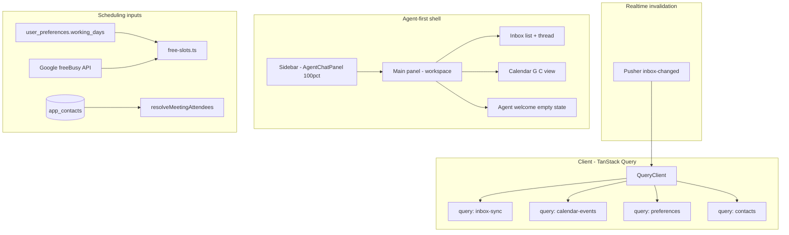

# Inbox, Calendar, Gmail & Homepage Overhaul

## How snooze suggestions work today

Snooze times are **not AI-generated**. [`getSnoozePresets()`](src/lib/activity.ts) computes four fixed client-side datetimes at render:

| Preset | Rule |
|--------|------|
| Later today · 8pm | Today 20:00, or tomorrow 20:00 if past |
| Tomorrow · 9am | Next day 09:00 |
| Monday · 9am | Next Monday 09:00 |
| Next week · 9am | +7 days at 09:00 |

[`snooze-picker.tsx`](src/components/inbox/snooze-picker.tsx) renders these; **Custom time** is disabled. Persist via `POST /api/inbox/snooze`. AI daily-brief/thread chips can suggest action type `"snooze"` but only **open the picker** — they do not pick a time.

**Change:** Replace disabled button with a datetime picker (minute precision, user timezone from `user_preferences.timezone`).

---

## Locked decisions (from alignment)

| Area | Choice |
|------|--------|
| Caching | **TanStack Query** — stale-while-revalidate, dedupe, invalidate on Pusher |
| Calendar placement | **Remove sidebar calendar from inbox**; keep **G C primary view** inside `/inbox` |
| Calendar v1 extras | Hour-grid day view, pre-brief on event click, attendee free/busy, all-day styling |
| Meeting duration | Selectable **30 / 45 / 60 min** only |
| Custom schedule time | Date+time picker + **overlap modal** (reschedule conflicting event or suggest new time) |
| Send later | **Presets + custom datetime picker** (composer + agent) |
| Working days | Onboarding **Q&A → structured JSON**; settings **text override** with sanitization |
| Contacts | Google Contacts **read-only import**, `.vcf`/`.csv`/plain list upload, sent-mail fallback with consent; **app DB only** (no Google writes) + CSV export (explicit in your request) |
| Build order | **Gmail + infra → calendar → onboarding/contacts → homepage** |
| Agent layout | **Agent fills 100% sidebar**; default landing = agent workspace; inbox/calendar open in **main panel** while agent stays visible |
| Primary nav | **Keep** Brief / Commitments / People / G I / G C; G I and G C also open embedded main panels (same as agent toolbar buttons) |
| @ mentions | **Contacts only** (app DB); `@` → fuzzy popover → **inline chips**; inject `email` + `displayName` into agent context |
| Agent email recipients | **`send_email` supports `to` / `cc` / `bcc` arrays**; multiple `@` chips + plain-text emails in chat all resolve to recipients |
| Mobile default tab | **Agent** on app open |
| Agent-first ship timing | **Phase 1E** (with TanStack Query + other agent fixes) |

---

## Architecture



---

## Phase 1 — Infrastructure + Gmail fixes (first)

### 1A. TanStack Query caching

**Add** `@tanstack/react-query` + `QueryClientProvider` in [`src/app/inbox/layout.tsx`](src/app/inbox/layout.tsx) (new) or [`inbox-client.tsx`](src/app/inbox/inbox-client.tsx).

| Query key | Source | Stale time | Invalidate on |
|-----------|--------|------------|---------------|
| `inbox-sync` | `GET /api/inbox/sync` | 30s (with Pusher) / 15s fallback | `inbox-changed`, tab focus (if stale) |
| `calendar-events` | `GET /api/inbox/events?month=` | 5 min | `calendar-updated` |
| `preferences` | `GET /api/inbox/preferences` | 10 min | PATCH preferences |
| `commitments` | per-thread | 2 min | thread actions |
| `send-time` | per counterparty | 1 hr | — |
| `daily-brief` | stream POST | hash-based (keep server cache) | brief invalidation key |
| `thread-summary` | GET then POST | message-count keyed | new messages |
| `snippets` | GET | 10 min | CRUD |
| `contacts` | GET | 5 min | import/rebuild |

**Refactor** [`inbox-shell.tsx`](src/components/inbox/inbox-shell.tsx): replace `useState` + repeated `useEffect` fetches with `useQuery` / `useMutation`. Keep optimistic updates for snooze/archive via `queryClient.setQueryData`.

**Reduce cost:** With Pusher connected, raise poll interval to **60s** (only as fallback); skip sync when `document.hidden`.

### 1B. Snooze custom time

- [`snooze-picker.tsx`](src/components/inbox/snooze-picker.tsx): datetime-local or shadcn calendar + time input; validate `until > now`.
- Keep existing presets from `getSnoozePresets()`.

### 1C. Send later — fix + enhance

**Investigate/fix** meeting confirmation send path:
- [`handleComposerSend`](src/components/inbox/inbox-shell.tsx) → `queueSendApi` → 5s undo → `dispatchSendApi` → [`dispatchScheduledSend`](src/lib/inbox/scheduled-sends.ts) → `sendGmailMessage`.
- Likely issues to audit: empty `bodyHtml` from Tiptap, `replyRecipients` returning empty `to`, dispatch 409 race, cron not running locally.

**Enhance** [`composer-panel.tsx`](src/components/inbox/composer-panel.tsx):
- Split **Send later** into dropdown: presets (1h, tonight 8pm, tomorrow 9am, Monday 9am) + **Pick time…** (minute-precision).
- Make AI send-time suggestion **clickable** to pre-fill picker.
- Activity bar: wire **cancel** for `scheduled_send` items (currently snooze-only cancel).

**Agent:** Add `schedule_send` tool in [`action-tools.ts`](src/lib/agent/action-tools.ts) mirroring composer queue; approval preview shows scheduled time.

### 1D. Meeting scheduling UX

| File | Change |
|------|--------|
| [`inline-availability-picker.tsx`](src/components/inbox/inline-availability-picker.tsx) | Make 30/45/60 chips **selectable**; pass `durationMinutes` up |
| [`inbox-shell.tsx`](src/components/inbox/inbox-shell.tsx) | Thread duration state; reschedule mode shows **prev slot with green outline** |
| New `schedule-overlap-modal.tsx` | On custom-time conflict: show conflicting event, actions **Reschedule that event** / **Pick another time** |
| [`free-slots.ts`](src/lib/calendar/free-slots.ts) | Read `working_days` from preferences (Phase 3); until then keep 9–17 weekdays |
| New API or extend meeting route | `GET /api/inbox/free-busy?emails=&start=&end=` using Google Calendar `freeBusy` |

**AI suggestion click:** In availability picker, make each suggested slot explicitly clickable (may already be — ensure visual affordance + opens confirm).

### 1E. Agent-first layout + @ mentions + multi-recipient email

#### Layout paradigm (new default)

Today [`inbox-shell.tsx`](src/components/inbox/inbox-shell.tsx) defaults `primaryView` to `"inbox"` and splits the sidebar vertically: agent (38%) + calendar (62%). Calendar primary view (`G C`) hides the agent entirely.

**New model:**

```
┌──────────┬────────────────────────────────┬─────────────────────┐
│ Primary  │  Main workspace panel          │  Agent sidebar      │
│ Nav      │  (inbox | calendar | brief |   │  AgentChatPanel     │
│          │   agent welcome)               │  100% height        │
└──────────┴────────────────────────────────┴─────────────────────┘
```

| State | Main panel | Sidebar |
|-------|------------|---------|
| **Default on load** | Agent welcome / quick-actions empty state | Full `AgentChatPanel` |
| Inbox button (agent toolbar or `G I`) | Thread list + thread view | Agent stays open |
| Calendar button (agent toolbar or `G C`) | Enhanced calendar (Phase 2) | Agent stays open |
| Brief (`G B` or nav) | Daily brief panel | Agent stays open |

**Implementation in [`inbox-shell.tsx`](src/components/inbox/inbox-shell.tsx):**
- Add `workspacePanel: "welcome" | "inbox" | "calendar" | "brief"` (default `"welcome"`).
- Remove vertical `Group` split inside sidebar — single `Panel id="agent"` at 100%.
- Remove `primaryView !== "calendar"` guard that hides agent sidebar.
- Widen default sidebar size (~35–40% of horizontal group).
- Persist sidebar width in existing `react-resizable-panels` localStorage key (update `DEFAULT_SIDEBAR_LAYOUT` — drop calendar child panel).

**Agent toolbar buttons** in [`agent-chat-panel.tsx`](src/components/inbox/agent-chat-panel.tsx):
- **Inbox** / **Calendar** icon buttons below header (or top bar next to history).
- `onOpenInbox` / `onOpenCalendar` callbacks from shell → set `workspacePanel`.
- Active state highlight when corresponding panel is open.

**PrimaryNav** ([`primary-nav.tsx`](src/components/inbox/primary-nav.tsx)):
- Keep Brief, Commitments, People, Settings links unchanged.
- `G I` / inbox nav item → set `workspacePanel = "inbox"` (not a separate full-page mode).
- `G C` → set `workspacePanel = "calendar"`.
- Nav "active" state reflects `workspacePanel`.

**Mobile** ([`inbox-shell.tsx`](src/components/inbox/inbox-shell.tsx) bottom tabs):
- Default `mobileTab` → `"agent"`.
- Inbox / Calendar tabs set `workspacePanel` and show embedded views (agent tab can show agent full-screen; inbox/calendar tabs show main embed without hiding agent history — or agent tab remains primary with buttons opening sub-views; match desktop intent: agent always one tap away).

#### @ contact mentions

New component [`agent-mention-input.tsx`](src/components/inbox/agent-mention-input.tsx) replacing plain `<input>` in agent chat:

1. User types `@` → fuzzy popover over **app contacts** (`useQuery(["contacts"])`).
2. Select contact → inline **chip** (`displayName` + stored `email`) in input.
3. Multiple `@` mentions allowed per message.
4. Plain-text emails typed without `@` still work (existing behavior).

**API payload:** extend agent chat POST body with `mentionedContacts: { email, displayName }[]` parsed client-side from chips + regex for bare emails in text.

**Server** ([`api/agent/chat/route.ts`](src/app/api/agent/chat/route.ts)):
- Append structured mention block to system context (not user-visible): `"Mentioned contacts: [{email, displayName}]"`.
- Depends on Phase 1F / Phase 3 `app_contacts` table; until import ships, fall back to existing warmth `contacts` rollup.

**New-email prompt:** if plain-text email not in contacts → trigger add-to-contacts modal (Phase 1F) before send.

#### CC / BCC + multi-recipient `send_email`

Extend [`agent-tools.ts` schema](src/lib/schemas/agent-tools.ts) and [`action-tools.ts`](src/lib/agent/action-tools.ts):

```ts
send_email: {
  to: string | string[]      // required
  cc?: string | string[]
  bcc?: string | string[]
  subject: string
  body: string
  threadId?: string
}
```

- Agent system prompt: when user `@` mentions contacts, map chips to `to`/`cc`/`bcc` per user instruction ("cc @Jane", "bcc team@…").
- Plain-text addresses in message body are valid recipients even without `@`.
- **Approval preview** ([`agent-tool-approval.tsx`](src/components/inbox/agent-tool-approval.tsx)): show To / Cc / Bcc rows separately.
- Wire CC/BCC through [`sendGmailMessage`](src/lib/corsair/actions.ts) (audit existing Gmail API call — add `cc`/`bcc` fields if missing).

#### Other agent fixes (unchanged from prior plan)

- **Edit first** in [`agent-tool-approval.tsx`](src/components/inbox/agent-tool-approval.tsx): `onEdit` → populate composer (email) or inline availability picker (calendar) with tool input.
- **Calendar agent tools** (first-class):
  - `list_calendar_events`, `reschedule_calendar_event`, `cancel_calendar_event`
  - Wire to [`corsair/actions.ts`](src/lib/corsair/actions.ts)
- Update [`system-prompt.ts`](src/lib/agent/system-prompt.ts): document CC/BCC, @ mention behavior, new calendar tools.

### 1F. New-email → contacts prompt

- New `app_contacts` table (or extend [`contacts`](src/lib/db/schema.ts) with `source: manual | google | import | inferred`) separate from warmth rollup.
- Modal on first use of unknown email (composer, meeting attendees, agent send): **Add to contacts?** / **Not now** / **Don't ask for this address**.
- Store choice in `contact_dismissals` or contact row with `status: dismissed`.
- **Never write to Google Contacts** — app DB only.

---

## Phase 2 — Calendar primary view overhaul

### Remove calendar from old sidebar split

Already handled in Phase 1E: sidebar is **agent-only** (100% height). Calendar renders in **main workspace** when `workspacePanel === "calendar"` (via agent toolbar button or `G C`).

### Enhanced G C view (center panel)

Refactor [`calendar-panel.tsx`](src/components/inbox/calendar-panel.tsx) into split layout:

```
┌─────────────────────┬──────────────────────┐
│  Event list         │  Month grid          │
│  (filterable)       │  (colored dots)      │
│  - grouped by type  │                      │
│  - click → highlight│  click date →        │
│    dates on grid    │  hour-grid below     │
└─────────────────────┴──────────────────────┘
```

**Event colors** (derive from existing `CalendarEvent.status` + DB `thread_meetings` link + focus-block marker):

| Type | Color | Source |
|------|-------|--------|
| Confirmed meeting | Blue | `status === confirmed` |
| Tentative | Amber | `status === tentative` |
| Focus block | Purple | event id in focus blocks table or summary prefix |
| Email-scheduled | Green | linked `thread_meetings` row |

**Interactions:**
- Click **event in list** → highlight all dates that event spans on month grid
- Click **date** → hour-grid day view ([`calendar-day-grid.tsx`](src/components/inbox/calendar-day-grid.tsx) new) showing timed + all-day events
- Click **event in day grid** → open [`MeetingPreBriefPanel`](src/components/inbox/meeting-pre-brief-panel.tsx) for primary attendee
- **All-day events**: separate lane at top of day grid, muted styling

**Attendee free/busy:** When scheduling from thread, fetch busy times for resolved attendees and mark slots busy in [`inline-availability-picker.tsx`](src/components/inbox/inline-availability-picker.tsx).

Delete or repurpose unused [`calendar-week-strip.tsx`](src/components/inbox/calendar-week-strip.tsx).

---

## Phase 3 — Onboarding, working days, contacts import

### Schema extension — `user_preferences`

Add to [`schema.ts`](src/lib/db/schema.ts) + migration:

```ts
workingDaysStructured: { timezone, days: { mon..sun: { enabled, start, end } } }
workingDaysTextOverride: string | null  // sanitized free text
workingDaysSource: 'wizard' | 'override'
onboardingCompletedAt: timestamp | null
```

### Prompt-injection guardrails for working-days text

New [`src/lib/preferences/sanitize-working-days.ts`](src/lib/preferences/sanitize-working-days.ts):
- Max 2KB; strip XML/HTML tags, markdown code fences, `system:` / `ignore previous` patterns
- Parse into **structured fields only** for AI context — never inject raw user text into system prompts
- AI scheduling prompt uses JSON summary: `"available Mon–Fri 9–17 IST"` not verbatim file contents
- Log + reject if entropy/line count exceeds threshold

### Onboarding flow (after Google connect)

Extend [`onboarding/connect`](src/app/onboarding/connect/page.tsx) into multi-step wizard:

1. **Google connect** (existing)
2. **Working days** — Q&A: timezone, active days, start/end per day; show **demo text** preview
3. **Contacts** — upload `.vcf`/`.csv`/paste emails OR connect Google Contacts (read-only) OR skip
4. **Skip summary** — explicit list: *"Without contacts: People warmth, pre-brief context, send-time optimization limited. With contacts: unlocks …"*
5. If no contacts: prompt **"Build from sent mail?"** → nightly-style one-time scan

### Contacts import pipeline

- `POST /api/inbox/contacts/import` — multipart file + format detection (vcf, csv, plain)
- `POST /api/connect/google-contacts` — optional OAuth scope addition; one-way pull into `app_contacts`
- `GET /api/inbox/contacts/export` — CSV download
- Rebuild [`contacts/rebuild.ts`](src/lib/contacts/rebuild.ts) to merge imported contacts with Gmail-derived warmth stats

### Homepage working-days showcase

In [`landing-page.tsx`](src/components/home/landing-page.tsx): new section with demo working-days text + animated scheduling slots respecting Mon–Fri 9–5 (Framer Motion).

**Demo text example:**
```
I work Mon–Thu 9:00–18:00 and Fri 9:00–13:00 (Asia/Kolkata).
No meetings before 10:00. Lunch 13:00–14:00 blocked daily.
```

---

## Phase 4 — Homepage Framer Motion overhaul

Refactor [`landing-page.tsx`](src/components/home/landing-page.tsx) + [`feature-showcase.tsx`](src/components/home/feature-showcase.tsx):

| Section | Change |
|---------|--------|
| Hero | Extend existing `motion` stagger to all sections |
| Seven features headline | Replace *"Seven features Superhuman won't build"* → benefit-led copy; one sentence per feature (Commitments, Pre-Brief, People, Focus, Export, Snippets, Send time) |
| Feature tabs | Click tab → **run Framer Motion demo** (state machine per feature) |
| Commitments | Animated Waiting For flow + **"How to set up"** steps (connect Gmail → AI extracts → press W) |
| Scheduling | *"Pick a 30/45/60 min window"* + slot animation |
| Relationships | Warmth grid animation |
| Agent | Full approve/edit/send animation sequence |
| Pricing | Subtle entrance animation; keep $15 positioning |

Respect `useReducedMotion()` everywhere (existing pattern in hero).

---

## Key files touched

| Phase | Primary files |
|-------|---------------|
| 1 | `inbox-shell.tsx`, `agent-chat-panel.tsx`, `agent-mention-input.tsx`, `composer-panel.tsx`, `inline-availability-picker.tsx`, `agent/action-tools.ts`, `schemas/agent-tools.ts`, `agent-tool-approval.tsx`, `corsair/actions.ts`, `snooze-picker.tsx`, new `schedule-overlap-modal.tsx`, `package.json` |
| 2 | `calendar-panel.tsx`, new `calendar-day-grid.tsx`, `inbox-shell.tsx` (layout) |
| 3 | `schema.ts`, `onboarding/*`, `preferences/route.ts`, `contacts/import.ts`, `sanitize-working-days.ts` |
| 4 | `landing-page.tsx`, `feature-showcase.tsx`, `mock/demo-data.ts` |

---

## Risks

| Risk | Mitigation |
|------|------------|
| TanStack Query migration breaks optimistic UX | Migrate one query at a time; keep shell as orchestrator |
| Google Contacts OAuth scope rejection | Optional step; file upload + sent-mail fallback |
| Working-days prompt injection | Structured-only AI context; sanitize + length limits |
| Attendee free/busy API quota | Cache per-day; only fetch when scheduling picker opens |
| Send-later dispatch failures | Add integration test + surface API errors in composer toast |
| Agent sidebar too narrow for long chats | Default 38% width; user-resizable; min 28% |
| @ mention without contacts DB | Fall back to warmth rollup contacts until Phase 3 import ships |
| CC/BCC Gmail API gaps | Audit `sendGmailMessage`; add fields + test with multi-recipient draft |

---

## Out of scope (per your choices)

- Dedicated `/calendar` route
- Drag-and-drop calendar reschedule
- Writing back to Google Contacts
- Arbitrary meeting durations beyond 30/45/60
- @ mention of threads / rich contact context (warmth, commitments) in v1 — contacts name+email only
- Agent full-screen mode (agent stays in sidebar per locked decision)
