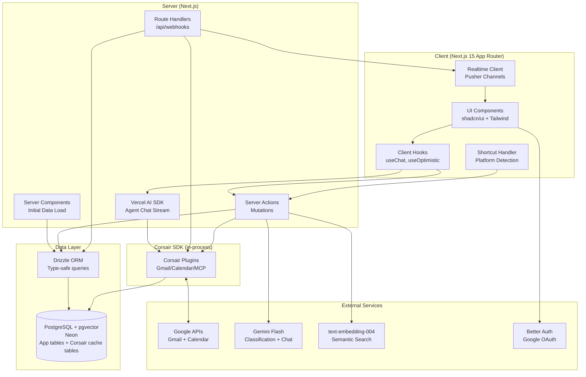
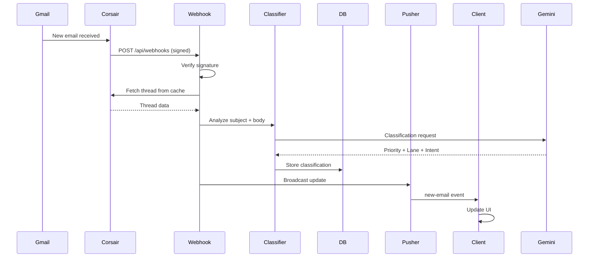

# Design Document: Command Inbox

## Overview

Command Inbox is a keyboard-first, scheduling-centric email and calendar command center built on Next.js 15 with the App Router. The system merges Gmail and Google Calendar into a unified interface, reducing the email-to-meeting workflow from 10-15 clicks to a single keystroke (the "Hero Workflow").

### Architecture Philosophy

The design prioritizes:
- **Keyboard-first interaction**: Every action accessible via shortcuts, with graceful mobile fallback
- **Sub-second responsiveness**: Optimistic UI updates with realtime sync
- **Unified data model**: Email threads and calendar events as first-class entities with shared state
- **Type safety end-to-end**: Zod schemas at API boundaries, Drizzle ORM for database, TypeScript throughout
- **Minimal external dependencies**: pgvector in Postgres eliminates need for separate vector database

### Technology Stack

**Frontend:**
- Next.js 15 App Router with React Server Components
- shadcn/ui + Tailwind CSS for UI components
- Framer Motion for transitions
- Vercel AI SDK for Agent Chat streaming

**Backend:**
- Next.js Server Actions for mutations
- Route Handlers for webhooks and external API endpoints
- PostgreSQL (Neon) with pgvector extension for semantic search
- Drizzle ORM for type-safe database access
- Pusher Channels for realtime updates

**Integration Layer (embedded in the app, not an external service):**
- Corsair SDK (`corsair`, `@corsair-dev/gmail`, `@corsair-dev/googlecalendar`, `@corsair-dev/mcp`) runs in-process inside the Next.js app with `multiTenancy: true`
- Corsair's cache tables live in the same Neon Postgres database as the app tables; reads never hit Google directly (everything served from Postgres in <1s)
- Users never provide Corsair API keys — Corsair is configured once at the application level; each tenant only completes Google OAuth to connect Gmail/Calendar
- Zero direct Google API calls: all Gmail/Calendar traffic goes through Corsair plugins

**External Services:**
- Google OAuth via Better Auth for authentication
- Gemini Flash (gemini-2.0-flash) for AI classification and chat
- text-embedding-004 for semantic embeddings

### Key User Flows

1. **Hero Workflow (M keystroke)**: Email thread → Extract scheduling intent → Show availability picker → Create calendar event → Draft confirmation reply
2. **Triage Processing**: Inbox → Priority-classified threads in lanes (Reply/Schedule/FYI/Done) → Archive (E), Reply (R), or Schedule (M)
3. **Agent Chat**: Natural language command → MCP tool execution → User approval → Action via Corsair
4. **Semantic Search**: Query (/) → Vector similarity search → Ranked results in <1s

## Architecture

### High-Level Component Diagram



### Server-Side Architecture

**Server Components:**
- Used for initial page loads (inbox list, thread view, calendar week strip)
- Fetch data directly via Drizzle ORM
- No client-side JavaScript for static content
- Reduce bundle size by 40-60% compared to client-only approach

**Server Actions:**
- Handle all mutations: send email, archive, snooze, create event
- Return typed responses validated with Zod
- Enable optimistic UI patterns via `useOptimistic` hook
- Pattern:
  ```typescript
  'use server'
  export async function archiveThread(threadId: string) {
    const result = await corsair.gmail.archive(threadId)
    revalidatePath('/inbox')
    return { success: true, threadId }
  }
  ```

**Route Handlers:**
- `/api/webhooks`: Receive Corsair Gmail/Calendar notifications
- `/api/chat`: Stream Agent Chat responses via Vercel AI SDK
- `/api/search`: Semantic search endpoint (optional, can be Server Action)

### Client-Side Architecture

**Optimistic UI Pattern:**
```typescript
const [optimisticThreads, addOptimisticThread] = useOptimistic(
  threads,
  (state, newThread) => [...state, newThread]
)

async function handleArchive(threadId: string) {
  // Immediate UI update
  addOptimisticThread({ ...thread, archived: true })
  
  // Background server action
  const result = await archiveThread(threadId)
  
  // Revalidation happens automatically via revalidatePath
}
```

**Realtime Updates:**
- Pusher Channels (free tier: 200k messages/day, 100 concurrent connections)
- Postgres polling (5s interval) as fallback
- Subscribe to tenant-specific channels: `tenant-${userId}-inbox`
- Push events: `new-email`, `calendar-update`, `classification-complete`

**Keyboard Shortcut System:**

Implementation library: `react-hotkeys-hook`, driven by the typed Shortcut Registry (single source of truth also consumed by the Command Palette, cheat sheet, and ShortcutHint tooltips). Scopes map to registry contexts: global / list / thread / composer.

```typescript
// Shortcut Registry (centralized config)
const shortcuts = {
  archive: { key: 'e', context: 'thread' },
  reply: { key: 'r', context: 'thread' },
  meeting: { key: 'm', context: 'thread' },
  palette: { key: 'k', mod: true, context: 'global' },
  // ...
}

// Platform Detection
const modKey = isMac ? 'Cmd' : 'Ctrl'
const modSymbol = isMac ? '⌘' : 'Ctrl'

// Context-aware activation
const isInputFocused = document.activeElement?.matches('input, textarea, [contenteditable]')
if (!isInputFocused && shortcut.context !== 'composer') {
  handleShortcut(shortcut)
}
```

### Integration Architecture: Corsair

**Deployment model:** Corsair is an SDK embedded in the Next.js application, not a hosted third-party service. It is configured once at app startup with `multiTenancy: true`, persists its Gmail/Calendar cache into dedicated tables in the same Neon Postgres database, and exposes per-tenant connections keyed by the Better Auth user. Onboarding flow: user signs in with Google OAuth → app creates a Corsair tenant for that user → user connects Gmail and Calendar through Corsair's plugin connect flow. No Corsair API keys are ever requested from users.

**Corsair Capabilities Used:**
1. **Gmail Plugin**: Fetch threads, send/reply, archive, search
2. **Google Calendar Plugin**: Fetch events, create/update/delete events
3. **Webhooks**: Realtime notifications for new emails and calendar changes
4. **MCP Adapter**: Tool-calling interface for Agent Chat
5. **Search API**: Advanced filtering (sender, date range, labels)

**Initial Backfill (first connect):**
- Classification and embedding normally happen only on the webhook path, so a freshly connected account would show empty lanes and empty semantic search
- After Gmail connects during onboarding, a background job pulls the **50 most recent threads** from Corsair's cache and runs classification + embedding on each, in small sequential batches that respect Gemini free-tier rate limits (~1-2 minutes total)
- UI shows a "Setting up your inbox…" progress indicator (n/50) while the backfill runs; lanes populate incrementally via realtime updates
- Threads older than the backfill window stay unclassified: reachable through Corsair advanced search, absent from lanes and pgvector search
- The backfill is idempotent (skips threads that already have a classification row), so it can be safely re-run

**Data Flow: New Email Arrives**


## Components and Interfaces

### Core UI Components

**ThreadList**
- Displays threads organized by Triage Lane (Reply, Schedule, FYI, Done)
- Done lane semantics (merged with archive): contains archived threads plus threads the classifier deems no-action; archiving (E) sets the thread's lane to Done; Done is hidden from the main triage flow and reachable via a separate view
- Server Component for initial load, realtime updates via Pusher
- Props: `lane: TriageLane`, `userId: string`
- Renders: Subject, sender, timestamp, priority badge, RSVP chips

**ThreadView**
- Full conversation display with messages in chronological order
- Server Component fetching thread via Corsair
- Props: `threadId: string`
- Supports: Reply composer (R), Archive (E), Schedule (M), Snooze (S)

**CalendarWeekStrip**
- Horizontal week view showing events with title, time, attendees
- Server Component for initial load, realtime updates for changes
- Props: `startDate: Date`, `userId: string`
- Highlights: Current time slot, availability gaps

**AvailabilityPicker**
- Inline calendar overlay triggered by M keystroke — works on **any** thread
- Client Component with optimistic event creation
- Two modes, decided by the classifier's scheduling intent:
  - **Intent mode** (`schedulingIntent` exists with `confidence >= 0.5`): proposed times from the email rendered as highlighted chips above the free slots
  - **Manual mode** (intent null or `confidence < 0.5`): no chips; shows the user's next free slots with 30-minute default duration and attendees pre-filled from thread participants
- Props: `threadId: string`, `schedulingIntent: SchedulingIntent | null`

**CommandPalette**
- Fuzzy-searchable action list (Mod+K)
- Client Component with command registry
- Displays: Action name, description, keyboard shortcut (platform-specific)
- Executes: Server Actions or client-side navigation

**AgentChat**
- Conversational interface using Vercel AI SDK `useChat` hook
- Client Component with streaming responses
- MCP tool calls require user approval before execution
- Props: `userId: string`, `mcpAdapter: CorsairMCPAdapter`

**ComposerPanel**
- Rich text email composer (Tiptap: bold, italic, links, lists; outputs HTML email) with AI draft generation
- Client Component with optimistic send
- Supports: Tone presets (Professional, Friendly, Brief), Send Later scheduling
- Keyboard: Mod+Enter to send, Escape to close
- Send Later: dropdown next to send button with presets (Tonight 8pm, Tomorrow 9am, Monday 9am, custom); scheduled sends listed in a "Scheduled" section with edit/cancel

**DefragView**
- Week fragmentation visualization accessible from the CalendarWeekStrip
- Client Component overlaying the week strip
- Shows: gaps <60min highlighted as "fragments", contiguous free blocks ≥2h as "focus time" with a weekly total
- Suggests meeting moves (based on user's own free slots) that consolidate fragments; accept applies the move via `updateEvent` and notifies attendees; dismiss hides the suggestion for the session

**ShortcutHint (tooltip)**
- Small tooltip rendered on hover/focus of any actionable element, showing the bound key (platform-adapted, e.g. ⌘K vs Ctrl+K)
- Reads from the Shortcut Registry — same source of truth as the Command Palette and cheat sheet
- Purpose: passive shortcut learning (plan §3.6)

### Data Interfaces

**Thread (from Corsair)**
```typescript
interface Thread {
  id: string
  subject: string
  snippet: string
  messages: Message[]
  participants: Participant[]
  labels: string[]
  timestamp: Date
  unread: boolean
}

interface Message {
  id: string
  from: Participant
  to: Participant[]
  body: string
  timestamp: Date
  attachments: Attachment[]
}
```

**Classification (stored in Postgres)**
```typescript
interface Classification {
  threadId: string
  priority: 'high' | 'medium' | 'low'
  lane: 'reply' | 'schedule' | 'fyi' | 'done'
  schedulingIntent: SchedulingIntent | null
  classifiedAt: Date
}

interface SchedulingIntent {
  proposedTimes: Date[]
  attendees: string[]
  duration: number // minutes
  confidence: number // 0-1
}
```

**CalendarEvent (from Corsair)**
```typescript
interface CalendarEvent {
  id: string
  summary: string
  start: Date
  end: Date
  attendees: Attendee[]
  location?: string
  description?: string
  organizer: Participant
  status: 'confirmed' | 'tentative' | 'cancelled'
}
```

**Shortcut Registry**
```typescript
interface Shortcut {
  key: string
  mod?: boolean // Cmd on Mac, Ctrl elsewhere
  shift?: boolean
  context: 'global' | 'thread' | 'list' | 'composer'
  action: string // Server Action name or client function
  description: string
}
```

### Server Action Interfaces

**Email Operations**
```typescript
// Send or reply to email
async function sendEmail(params: {
  to: string[]
  subject: string
  body: string
  threadId?: string // if reply
}): Promise<{ success: boolean; messageId: string }>

// Archive thread
async function archiveThread(threadId: string): Promise<{ success: boolean }>

// Snooze thread
async function snoozeThread(threadId: string, until: Date): Promise<{ success: boolean }>

// Schedule email for later sending
async function scheduleSend(params: {
  to: string[]
  subject: string
  body: string
  threadId?: string
  sendAt: Date
}): Promise<{ success: boolean; scheduledSendId: string }>

// Edit or cancel a scheduled send (before sendAt)
async function updateScheduledSend(id: string, updates: { sendAt?: Date; body?: string }): Promise<{ success: boolean }>
async function cancelScheduledSend(id: string): Promise<{ success: boolean }>
```

**Calendar Operations**
```typescript
// Create calendar event
async function createEvent(params: {
  summary: string
  start: Date
  end: Date
  attendees: string[]
  location?: string
}): Promise<{ success: boolean; eventId: string }>

// Update existing event
async function updateEvent(eventId: string, updates: Partial<CalendarEvent>): Promise<{ success: boolean }>

// Cancel event
async function cancelEvent(eventId: string): Promise<{ success: boolean }>
```

**AI Operations**
```typescript
// Generate reply draft
async function generateReplyDraft(params: {
  threadId: string
  tone: 'professional' | 'friendly' | 'brief'
}): Promise<{ draft: string }>

// Classify email (called from webhook)
async function classifyEmail(threadId: string): Promise<Classification>
```

**Search Operations**
```typescript
// Semantic search
async function semanticSearch(query: string, limit: number = 20): Promise<Thread[]>

// Advanced search with filters
async function advancedSearch(filters: {
  sender?: string
  dateRange?: [Date, Date]
  hasAttachment?: boolean
  lane?: TriageLane
  semanticQuery?: string
}): Promise<Thread[]>
```

### MCP Integration Interface

**CorsairMCPAdapter**
```typescript
interface MCPTool {
  name: string
  description: string
  schema: ZodSchema
}

class CorsairMCPAdapter {
  async listTools(): Promise<MCPTool[]>
  
  async executeTool(name: string, params: unknown): Promise<unknown>
  
  // Example tools exposed by Corsair MCP:
  // - gmail_send_email
  // - gmail_search_threads
  // - calendar_create_event
  // - calendar_list_availability
}
```

**Agent Chat Integration — Human-in-the-Loop Approval (Vercel AI SDK pattern)**

Destructive tools (`send_email`, `create_meeting`) are defined **without an `execute` function**. The model's tool call streams to the client and pauses; the client renders an approval card; on approve, the client executes the operation (via a server action calling Corsair MCP) and sends the result back with `addToolResult`, which resumes the conversation. This preserves multi-step chaining — for the brief's example prompt, the model needs the result of `create_meeting` before composing the follow-up `send_email`.

```typescript
// Route Handler: /api/chat
import { streamText } from 'ai'
import { google } from '@ai-sdk/google'

export async function POST(req: Request) {
  const { messages } = await req.json()
  
  const result = await streamText({
    model: google('gemini-2.0-flash'),
    messages,
    maxSteps: 5, // allow multi-step tool chains (e.g. create invite, then send email)
    tools: {
      // No `execute` — tool calls pause and surface to the client for approval
      send_email: {
        description: 'Send an email (requires user approval)',
        parameters: z.object({
          to: z.string().email(),
          subject: z.string(),
          body: z.string()
        })
      },
      create_meeting: {
        description: 'Create a calendar event (requires user approval)',
        parameters: z.object({
          summary: z.string(),
          start: z.string().datetime(),
          end: z.string().datetime(),
          attendees: z.array(z.string().email())
        })
      },
      // Read-only tools execute server-side without approval
      search_threads: {
        description: 'Search email threads',
        parameters: z.object({ query: z.string() }),
        execute: async ({ query }) => corsair.mcp.execute('gmail_search_threads', { query })
      },
      list_availability: {
        description: "List free slots in the user's calendar",
        parameters: z.object({ start: z.string().datetime(), end: z.string().datetime() }),
        execute: async (params) => corsair.mcp.execute('calendar_list_availability', params)
      }
    }
  })
  
  return result.toDataStreamResponse()
}
```

```typescript
// Client: AgentChat approval handling
const { messages, addToolResult } = useChat({ api: '/api/chat' })

async function onApprove(toolCallId: string, toolName: string, args: unknown) {
  const result = await executeApprovedTool(toolName, args) // server action → Corsair MCP
  addToolResult({ toolCallId, result }) // resumes the model with the tool result
}

function onDeny(toolCallId: string) {
  addToolResult({ toolCallId, result: { denied: true, reason: 'User declined this action' } })
  // Model acknowledges the denial and does not execute (Req 15.7)
}
```

## Data Models

### Database Schema (Drizzle ORM)

**Users Table**
```typescript
export const users = pgTable('users', {
  id: text('id').primaryKey(),
  email: text('email').notNull().unique(),
  name: text('name'),
  googleAccessToken: text('google_access_token'),
  googleRefreshToken: text('google_refresh_token'),
  corsairTenantId: text('corsair_tenant_id'), // links the user to their Corsair multi-tenant connection
  createdAt: timestamp('created_at').defaultNow(),
  updatedAt: timestamp('updated_at').defaultNow()
})
```

Note: Google OAuth tokens for Gmail/Calendar access are managed by Corsair's own cache tables (created by Corsair migrations in the same database). The app does not call Google APIs directly.

**Classifications Table**
```typescript
export const classifications = pgTable('classifications', {
  id: text('id').primaryKey(),
  userId: text('user_id').references(() => users.id).notNull(),
  threadId: text('thread_id').notNull(),
  priority: text('priority', { enum: ['high', 'medium', 'low'] }).notNull(),
  lane: text('lane', { enum: ['reply', 'schedule', 'fyi', 'done'] }).notNull(),
  // Denormalized display fields, captured at classification time so semantic
  // search renders results from this single table (guaranteed <1s, no joins
  // against Corsair's cache schema)
  subject: text('subject').notNull(),
  sender: text('sender').notNull(),
  snippet: text('snippet').notNull(),
  schedulingIntent: json('scheduling_intent').$type<SchedulingIntent>(),
  classifiedAt: timestamp('classified_at').defaultNow(),
  embedding: vector('embedding', { dimensions: 768 })
})

// Indexes
export const classificationsByUser = index('classifications_user_idx').on(classifications.userId)
export const embeddingIndex = index('embedding_idx').on(classifications.embedding).using('hnsw', sql`vector_cosine_ops`)
```

**Snoozes Table**
```typescript
export const snoozes = pgTable('snoozes', {
  id: text('id').primaryKey(),
  userId: text('user_id').references(() => users.id).notNull(),
  threadId: text('thread_id').notNull(),
  snoozedUntil: timestamp('snoozed_until').notNull(),
  createdAt: timestamp('created_at').defaultNow()
})

export const snoozesByUserAndTime = index('snoozes_user_time_idx').on(snoozes.userId, snoozes.snoozedUntil)
```

**Snooze semantics (filter-based, no lane mutation):**
- Snoozing never modifies the thread's classification or lane — the classification row keeps its lane the entire time
- Lane views filter out threads with an active snooze (`snoozed_until > now()`)
- Restoration = the cron handler deletes the expired snooze row and broadcasts a realtime update; the thread reappears in its original lane by construction (no `original_lane` column needed, Property 6 holds trivially)
- Undo snooze = delete the snooze row immediately

**Drafts Table (for AI-generated drafts awaiting user approval)**
```typescript
export const drafts = pgTable('drafts', {
  id: text('id').primaryKey(),
  userId: text('user_id').references(() => users.id).notNull(),
  threadId: text('thread_id'),
  content: text('content').notNull(),
  tone: text('tone', { enum: ['professional', 'friendly', 'brief'] }),
  approved: boolean('approved').default(false),
  createdAt: timestamp('created_at').defaultNow()
})
```

**ScheduledSends Table (for Send Later)**
```typescript
export const scheduledSends = pgTable('scheduled_sends', {
  id: text('id').primaryKey(),
  userId: text('user_id').references(() => users.id).notNull(),
  threadId: text('thread_id'), // null for new emails, set for replies
  to: json('to').$type<string[]>().notNull(),
  subject: text('subject').notNull(),
  body: text('body').notNull(),
  sendAt: timestamp('send_at').notNull(),
  status: text('status', { enum: ['pending', 'sent', 'cancelled', 'failed'] }).notNull().default('pending'),
  sentAt: timestamp('sent_at'),
  createdAt: timestamp('created_at').defaultNow()
})

export const scheduledSendsByTime = index('scheduled_sends_time_idx').on(scheduledSends.status, scheduledSends.sendAt)
```

**Undo Send (delayed dispatch):**
- Every send is held server-side for 5 seconds before reaching Corsair: the send action inserts a `scheduled_sends` row with `send_at = now() + 5s` and dispatches it in the same server request after the window elapses (the row's pending status acts as the durable fallback if the request dies — the cron picks it up)
- Undo within the window flips the row's status to `cancelled` and reopens the composer with the content
- Optimistic UI shows the message as sent immediately; the 5s hold is invisible unless undo is used

**Scheduled Job Processing (Send Later + Snooze Expiry)**
- A free external pinger (cron-job.org, or Upstash QStash free tier) hits `/api/cron/process-due` every minute — Vercel Hobby cron only supports daily schedules, so the trigger lives outside Vercel
- The endpoint is protected by a shared secret: requests must include `Authorization: Bearer ${CRON_SECRET}` (validated via env, rejected with 401 otherwise)
- The handler dispatches: (1) `scheduled_sends` rows with `status = 'pending' AND send_at <= now()` → send via Corsair, mark `sent` (or `failed` with retry); (2) `snoozes` rows with `snoozed_until <= now()` → delete the snooze row (thread reappears in its unchanged original lane via the view filter) and broadcast a realtime update
- Idempotency: each row is claimed with an `UPDATE ... WHERE status = 'pending' RETURNING` to avoid double-sends on overlapping cron runs
- Worst-case latency is ~1-2 minutes past the scheduled time, which is acceptable for both send-later and snooze restoration

**WebhookLogs Table (for debugging and replay)**
```typescript
export const webhookLogs = pgTable('webhook_logs', {
  id: text('id').primaryKey(),
  userId: text('user_id').references(() => users.id),
  payload: json('payload').notNull(),
  signature: text('signature'), // header value; null when the header was missing

  verified: boolean('verified').notNull(),
  processedAt: timestamp('processed_at').defaultNow(),
  error: text('error')
})
```

### Type Safety with Zod

**Webhook Payload Schemas**
```typescript
const GmailWebhookSchema = z.object({
  type: z.literal('gmail.message.received'),
  timestamp: z.string().datetime(),
  threadId: z.string(),
  userId: z.string()
})

const CalendarWebhookSchema = z.object({
  type: z.enum(['calendar.event.created', 'calendar.event.updated', 'calendar.event.deleted']),
  timestamp: z.string().datetime(),
  eventId: z.string(),
  userId: z.string()
})

const WebhookPayloadSchema = z.discriminatedUnion('type', [
  GmailWebhookSchema,
  CalendarWebhookSchema
])
```

**Webhook Signature Verification (header-based)**

The signature is NOT part of the JSON payload. Corsair signs the raw request body and sends the signature in an HTTP header. Verification must happen against the raw body bytes before JSON parsing:

```typescript
// Route Handler: /api/webhooks
export async function POST(req: Request) {
  const rawBody = await req.text()
  const signature = req.headers.get('x-corsair-signature')
  
  if (!signature || !corsair.webhooks.verifySignature(rawBody, signature)) {
    await logWebhookAttempt({ rawBody, signature, verified: false })
    return new Response('Invalid signature', { status: 401 })
  }
  
  const payload = WebhookPayloadSchema.parse(JSON.parse(rawBody))
  // ... process payload
}
```

**Classification Schemas**
```typescript
const SchedulingIntentSchema = z.object({
  proposedTimes: z.array(z.date()),
  attendees: z.array(z.string().email()),
  duration: z.number().int().positive(),
  confidence: z.number().min(0).max(1)
})

const ClassificationSchema = z.object({
  threadId: z.string(),
  priority: z.enum(['high', 'medium', 'low']),
  lane: z.enum(['reply', 'schedule', 'fyi', 'done']),
  schedulingIntent: SchedulingIntentSchema.nullable(),
  classifiedAt: z.date()
})
```

### Vector Search with pgvector

**Embedding Generation**
```typescript
async function generateEmbedding(text: string): Promise<number[]> {
  const response = await fetch('https://generativelanguage.googleapis.com/v1beta/models/text-embedding-004:embedContent', {
    method: 'POST',
    headers: { 'Content-Type': 'application/json' },
    body: JSON.stringify({ content: { parts: [{ text }] } })
  })
  
  const data = await response.json()
  return data.embedding.values // 768-dimensional vector
}
```

**Semantic Search Query**
```typescript
async function semanticSearch(query: string, userId: string, limit: number = 20): Promise<Classification[]> {
  const queryEmbedding = await generateEmbedding(query)
  
  const results = await db
    .select()
    .from(classifications)
    .where(eq(classifications.userId, userId))
    .orderBy(sql`embedding <=> ${queryEmbedding}`)
    .limit(limit)
  
  return results
}
```

**Index Configuration**
- HNSW index for fast approximate nearest neighbor search
- Expected p95 latency: <100ms for 100K vectors
- Recall: ~98% with default parameters (m=16, ef_construction=200)

### Database Migration Strategy

**Migration Files (Drizzle)**
```typescript
// migrations/0001_initial_schema.ts
import { sql } from 'drizzle-orm'

export async function up(db) {
  await db.execute(sql`CREATE EXTENSION IF NOT EXISTS vector`)
  // Create tables with Drizzle schema definitions
}

export async function down(db) {
  // Rollback logic
}
```

**Migration Execution**
- Sequential application on deployment
- Version tracking in `drizzle_migrations` table
- Idempotent migrations using `IF NOT EXISTS`
- Zero-downtime patterns: additive changes first, then deprecate old columns

## Correctness Properties

*A property is a characteristic or behavior that should hold true across all valid executions of a system—essentially, a formal statement about what the system should do. Properties serve as the bridge between human-readable specifications and machine-verifiable correctness guarantees.*

This feature involves substantial infrastructure (OAuth, webhooks, realtime connections), UI rendering, and external service integrations (Corsair, Gemini, Google Calendar). While certain data transformation logic is suitable for property-based testing, much of the system requires integration tests, snapshot tests, and example-based unit tests.

**PBT IS applicable for:**
- Data parsing and serialization (webhook payloads, thread objects, calendar events)
- Keyboard shortcut context logic (input focus detection)
- Priority classification determinism (same input → same output)
- Snooze time calculations

**PBT IS NOT applicable for:**
- OAuth flow and token refresh (integration test)
- Realtime websocket behavior (integration test)
- UI rendering and layout (snapshot test)
- External API calls to Corsair/Gemini (mock-based unit test)
- Optimistic UI state management (example-based test)

### Property 1: Webhook Payload Round-Trip Preservation

*For any* valid webhook payload (Gmail or Calendar type), parsing then serializing then parsing SHALL produce an equivalent object with all fields preserved.

**Validates: Requirements 21.5**

### Property 2: Thread Object Round-Trip Preservation

*For any* valid thread object with messages, participants, and attachments, parsing then serializing then parsing SHALL produce an equivalent object with all nested data preserved.

**Validates: Requirements 21.6**

### Property 3: Calendar Event Round-Trip Preservation

*For any* valid calendar event with attendees, time, location, and metadata, parsing then serializing then parsing SHALL produce an equivalent object with all fields preserved.

**Validates: Requirements 21.7**

### Property 4: Input Focus Bidirectional Shortcut State

*For any* input element (input, textarea, or contenteditable), focusing the element SHALL disable single-key shortcuts, and unfocusing SHALL restore them to their previous enabled state.

**Validates: Requirements 12.5, 12.6**

### Property 5: AI Operation Determinism

*For any* email thread and AI operation (classification, draft generation with tone preset), executing the operation multiple times with identical inputs SHALL produce consistent outputs with the same semantic content and tone characteristics.

**Validates: Requirements 7.5, 16.6**

### Property 6: Snooze Expiry Lane Restoration

*For any* snoozed thread with an original Triage_Lane, when the snooze time expires, the thread SHALL reappear in the same Triage_Lane it was in before being snoozed.

**Validates: Requirements 5.4**

## Error Handling

### Error Categories and Strategies

**Network Errors (External Service Failures)**
- **Corsair API failures**: Retry with exponential backoff (3 attempts: 1s, 2s, 4s)
- **Google OAuth token expiration**: Catch 401 responses, prompt user for reauthentication, preserve user's current state
- **Realtime connection drops**: Auto-reconnect with exponential backoff, fall back to 5-second polling
- **Webhook signature verification failures**: Log to `webhook_logs` table with error details, return HTTP 401, alert monitoring

**Parsing and Validation Errors**
- **Malformed webhook payloads**: Log full payload to `webhook_logs`, return HTTP 400 with specific Zod validation error message
- **Invalid thread or calendar data from Corsair**: Log error with raw data, display user-friendly error toast ("Failed to load thread"), allow retry
- **Zod schema validation failures**: Return structured error with field-level details, preserve user input for correction

**User Operation Failures**
- **Email send failures**: Preserve draft in `drafts` table, show error toast with retry button, display undo option
- **Calendar event creation failures**: Revert optimistic UI update, show error message with specific reason (e.g., "Conflicting time slot"), allow manual retry
- **Archive/snooze failures**: Revert optimistic UI, show 5-second undo toast with error indicator
- **Scheduled send failures (cron dispatch)**: Mark row as `failed`, retry up to 3 times with backoff, then surface a notification in the UI with the preserved draft for manual send

**AI Operation Failures**
- **Classification timeout (>1.5s)**: Fall back to default lane (Reply) and medium priority, queue for background retry
- **Draft generation failures**: Show fallback empty composer with error indicator, allow manual composition
- **Embedding generation failures**: Log error, skip semantic search indexing, continue with basic search functionality

**Database Errors**
- **Connection failures**: Retry with exponential backoff (5 attempts), display maintenance mode banner if all retries fail
- **Query timeouts**: Log slow query, return cached data if available, display stale data indicator
- **Migration failures**: Prevent application startup, log detailed migration error, require manual intervention

**Rate Limiting and Quota Errors**
- **Gemini API rate limits**: Queue requests with exponential backoff, display "Processing..." indicator to user
- **Corsair API quotas**: Display user-facing error with retry time, cache frequently accessed data
- **pgvector search overload**: Fall back to basic Corsair search API, log performance warning

### Error Response Patterns

**Server Actions**
```typescript
type ActionResponse<T> = 
  | { success: true; data: T }
  | { success: false; error: string; retryable: boolean }

// Example
async function archiveThread(threadId: string): Promise<ActionResponse<void>> {
  try {
    await corsair.gmail.archive(threadId)
    revalidatePath('/inbox')
    return { success: true, data: undefined }
  } catch (error) {
    if (error instanceof CorsairNetworkError) {
      return { success: false, error: 'Connection failed', retryable: true }
    }
    return { success: false, error: 'Archive failed', retryable: false }
  }
}
```

**Client Error Display**
- **Toast notifications**: 5-second display for transient errors with optional retry button
- **Inline error messages**: Display below form inputs for validation errors
- **Error boundaries**: Catch React component errors, display fallback UI with reload button
- **Optimistic UI reversion**: Smoothly animate state back to pre-action state on failure

### Monitoring and Observability

**Error Logging**
- Log all errors to console in development
- Send production errors to monitoring service (Vercel Logs or external APM)
- Include: error message, stack trace, user ID, timestamp, request context

**Webhook Monitoring**
- Store all webhook attempts in `webhook_logs` table
- Track: payload, signature, verification status, processing time, errors
- Alert on: signature verification failures, processing timeouts (>2s), high error rates (>5%)

**Performance Monitoring**
- Track p50, p95, p99 latency for: Server Actions, Corsair API calls, database queries, AI operations
- Alert on: Hero Workflow >3s, semantic search >1s, webhook processing >2s
- Dashboard: Real-time operation counts, error rates, latency histograms


## Testing Strategy

### Testing Approach Overview

Command Inbox employs a layered testing strategy combining property-based testing for data transformations, example-based unit tests for business logic, integration tests for external services, and end-to-end tests for critical user workflows.

### Property-Based Testing

**Library:** `fast-check` (JavaScript/TypeScript property-based testing)

**Test Configuration:**
- Minimum 100 iterations per property test
- Each property test references its design document property via comment tag
- Tag format: `// Feature: command-inbox, Property N: [property description]`

**Properties to Implement:**

1. **Webhook Payload Round-Trip Preservation**
   - Generator: Create random webhook payloads for both Gmail and Calendar types
   - Test: parse→serialize→parse produces equivalent object
   - Validation: Deep equality check on all fields
   - Tag: `// Feature: command-inbox, Property 1: Webhook Payload Round-Trip Preservation`

2. **Thread Object Round-Trip Preservation**
   - Generator: Create threads with 1-10 messages, 2-20 participants, 0-5 attachments
   - Test: parse→serialize→parse produces equivalent nested structure
   - Validation: Deep equality including message order and attachment metadata
   - Tag: `// Feature: command-inbox, Property 2: Thread Object Round-Trip Preservation`

3. **Calendar Event Round-Trip Preservation**
   - Generator: Create events with varying attendee counts, time zones, optional fields
   - Test: parse→serialize→parse preserves all fields
   - Validation: Deep equality including datetime precision
   - Tag: `// Feature: command-inbox, Property 3: Calendar Event Round-Trip Preservation`

4. **Input Focus Bidirectional Shortcut State**
   - Generator: Create DOM states with different input element types focused/unfocused
   - Test: focus→check shortcuts disabled→unfocus→check shortcuts enabled
   - Validation: Shortcut handler state matches expected enabled/disabled
   - Tag: `// Feature: command-inbox, Property 4: Input Focus Bidirectional Shortcut State`

5. **AI Operation Determinism**
   - Generator: Create thread objects with scheduling-related content
   - Test: Run classification twice, compare scheduling intent extraction
   - Validation: Identical priority, lane, proposed times, attendees
   - Note: Use mocked Gemini API responses for determinism
   - Tag: `// Feature: command-inbox, Property 5: AI Operation Determinism`

6. **Snooze Expiry Lane Restoration**
   - Generator: Create threads in different lanes with snooze times
   - Test: Snooze thread→advance time past expiry→check lane matches original
   - Validation: Lane field matches pre-snooze value
   - Tag: `// Feature: command-inbox, Property 6: Snooze Expiry Lane Restoration`

### Unit Testing

**Framework:** Vitest (fast, Vite-native test runner)

**Focus Areas:**
- **Shortcut registry logic**: Platform detection, modifier key mapping, context filtering
- **Classification helpers**: Intent extraction, priority scoring, lane assignment rules
- **Time calculations**: Snooze duration parsing, relative timestamp formatting
- **Zod schema validation**: Edge cases for webhook payloads, thread data, calendar events
- **Optimistic UI reducers**: State transitions for archive, send, create event actions

**Example Test Cases:**
- Platform detection returns correct mod key symbol (⌘ vs Ctrl)
- Single-key shortcuts disabled when input focused, enabled when unfocused
- Invalid webhook signature rejected with HTTP 401
- Snooze "tomorrow 9am" correctly calculates next occurrence
- Optimistic thread removal animates and reverts on failure

**Coverage Target:** 80%+ for utility functions, 60%+ for UI components

### Integration Testing

**Framework:** Vitest + MSW (Mock Service Worker) for API mocking

**Focus Areas:**
- **Corsair API integration**: Mock Gmail plugin responses, Calendar plugin responses, search API
- **Gemini API integration**: Mock classification and draft generation responses
- **Webhook flow**: Simulate Corsair webhook delivery, signature verification, processing
- **Realtime updates**: Mock Pusher connection, broadcast events, client reception
- **Database operations**: Use in-memory Postgres or test database with migrations

**Key Integration Tests:**
- New email webhook → classification → database insert → realtime broadcast → client update
- Hero Workflow: M keystroke → scheduling intent extraction → availability fetch → event creation → draft generation
- Archive thread → Corsair API call → optimistic UI update → revalidation
- Agent Chat tool call → approval dialog → MCP execution → confirmation message
- Semantic search: query → embedding generation → pgvector search → ranked results

**Test Database:**
- Use Docker Postgres with pgvector extension for integration tests
- Run migrations before test suite
- Seed with realistic test data (threads, classifications, events)
- Teardown and recreate between test files

### End-to-End Testing

**Framework:** Playwright (cross-browser E2E testing)

**Critical User Flows:**
1. **Hero Workflow (M keystroke)**
   - Sign in → view inbox → select thread with scheduling intent → press M → select time slot → verify event created → verify draft generated → send confirmation
   - Expected: <3 seconds from M press to event confirmation

2. **Triage Processing**
   - View Reply lane → press R to reply → compose message → Mod+Enter to send → press E to archive → verify thread archived
   - Expected: <1 second per action

3. **Command Palette**
   - Press Mod+K → type "archive" → select action → verify thread archived
   - Expected: <100ms palette render

4. **Agent Chat**
   - Open Agent Chat → type "Schedule a meeting with friend@corsair.dev tomorrow at 2pm" → approve action → verify event created
   - Expected: Tool call executes after approval

5. **Semantic Search**
   - Press / → type natural language query → verify relevant results appear
   - Expected: <1 second results

**E2E Test Environment:**
- Mock Corsair API with predefined thread/event data
- Mock Gemini API with canned responses
- Use test Google OAuth credentials
- Run against local development server

**Browser Coverage:** Chromium (desktop), Mobile Safari (PWA), Firefox (keyboard shortcuts)

### Performance Testing

**Benchmarks:**
- Hero Workflow: <3 seconds end-to-end (measured with Playwright)
- Semantic search: <1 second for 100K embeddings (measured with pgvector EXPLAIN ANALYZE)
- Webhook processing: <2 seconds from receipt to client update (measured with timestamps)
- Initial page load: <2 seconds (measured with Lighthouse)
- Command Palette render: <100ms (measured with React DevTools Profiler)

**Load Testing:**
- Simulate 100 concurrent users processing inbox (using Artillery or k6)
- Measure database query performance under load
- Test webhook endpoint throughput (requests/second)

### Testing Infrastructure

**CI/CD Pipeline:**
1. Run linting (ESLint, TypeScript compiler)
2. Run unit tests (Vitest) with coverage reporting
3. Run integration tests with test database
4. Run property-based tests (100+ iterations)
5. Run E2E tests (Playwright) against preview deployment
6. Generate test report and coverage badge

**Local Development:**
- `npm run test`: Run unit and integration tests in watch mode
- `npm run test:pbt`: Run property-based tests with verbose output
- `npm run test:e2e`: Run E2E tests with headed browser
- `npm run test:coverage`: Generate coverage report

**Test Data Management:**
- Store test fixtures in `__fixtures__` directories
- Use factory functions for generating test data
- Seed test database with representative data via migration
- Mock external API responses with MSW handlers

### Quality Gates

**Pre-Merge Requirements:**
- All tests pass (unit, integration, property-based)
- Coverage remains above 75%
- No TypeScript errors
- Lighthouse score >90 (performance, accessibility, best practices)
- No console errors in E2E tests

**Production Deployment Requirements:**
- E2E tests pass on staging environment
- Manual QA of Hero Workflow
- Webhook endpoint responds to test notification
- Database migrations apply successfully
- Monitoring dashboards show green health checks
