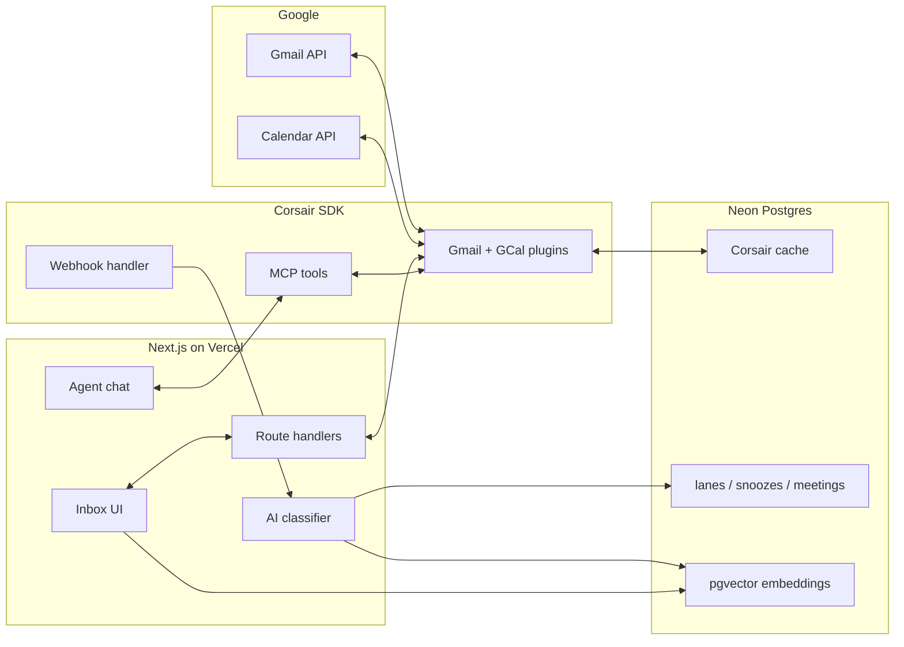

# Command Inbox

A keyboard-first Gmail + Google Calendar command center built on [Corsair](https://corsair.dev). Triage your inbox into Reply / Schedule / FYI lanes, convert emails to meetings in one keystroke, and run multi-step agent workflows via Corsair MCP.

## Features

- **Auth & multi-tenancy** — Better Auth + Google OAuth; one Corsair tenant per user
- **AI triage** — Gemini or OpenAI classifies inbound mail into lanes with scheduling intent extraction
- **Semantic search** (`/`) — pgvector over **indexed inbox threads** (last 50 classified immediately on connect; full INBOX indexes in background with progress banner)
- **Advanced search** (`Mod+Shift+F`) — Corsair Gmail `threads.list({ q })` across **full mailbox history** (sender, dates, lane, attachments)
- **Hero workflow** (`M`) — inline availability → calendar invite + confirmation draft
- **Agent chat** — Corsair MCP discovery tools + approval-gated `send_email` / `create_calendar_invite`; native Gmail attachments (upload or forward from thread, up to ~20 MB per file) with approval preview
- **Command palette & shortcuts** — Superhuman-style keys; PWA + mobile tabs

## Architecture



**Data flow:** Gmail push → Pub/Sub → `/api/webhooks` → Corsair processes event → AI classify + pgvector embed → Pusher → UI. Inbox reads go through the **Corsair SDK** (`tenant.gmail.api.*`, `tenant.googlecalendar.api.*`), which handles OAuth and caches mail in Postgres. App-owned tables store lanes, snoozes, meetings, and embeddings. **Semantic search (`/`)** queries locally indexed threads; **advanced search (`Mod+Shift+F`)** hits Gmail history via Corsair.

## Stack

| Layer | Tech |
|-------|------|
| App | Next.js 15, React 19, Tailwind, shadcn/ui |
| Data | Neon Postgres, Drizzle, pgvector |
| Integrations | Corsair SDK (`@corsair-dev/gmail`, `@corsair-dev/googlecalendar`, `@corsair-dev/mcp`) |
| AI | Vercel AI SDK — GPT-5 Nano + Gemini 2.5 Flash (OpenAI first, fallback on provider rate limits); per-user API rate limits on chat/send/draft |
| Auth | Better Auth (Google) |
| Realtime | Pusher Channels |

## Quick start

### 1. Clone & install

```bash
git clone https://github.com/sayantanbal/commad-inbox.git
cd commad-inbox
bun install
```

### 2. Environment

Copy `.env.example` → `.env.local` and fill in:

| Variable | Required | Notes |
|----------|----------|-------|
| `DATABASE_URL` | Yes | Neon Postgres with pgvector |
| `CORSAIR_KEK` | Yes | `openssl rand -base64 32` — stable across runs |
| `GOOGLE_CLIENT_ID` / `SECRET` | Yes | Gmail + Calendar OAuth (testing mode OK) |
| `BETTER_AUTH_SECRET` | Yes | `openssl rand -base64 32` |
| `GOOGLE_GENERATIVE_AI_API_KEY` | One of AI keys | Gemini |
| `OPENAI_API_KEY` | One of AI keys | Fallback + optional primary |
| `GMAIL_PUBSUB_TOPIC` | Phase 2 | `projects/…/topics/…` for webhooks |
| `PUSHER_*` | Phase 2 | Realtime push |
| `CRON_SECRET` | Phase 3+ | Bearer for `/api/cron/process-due` |

### 3. Database & Corsair

```bash
bun run db:migrate
bun run corsair:setup
bun run smoke:corsair   # optional sanity check
```

### 4. Dev server

```bash
bun dev
```

Open [http://localhost:3000](http://localhost:3000) → sign in → connect Google.

### 5. Webhooks (local)

```bash
ngrok http 3000
```

Set `APP_URL` to the ngrok HTTPS URL. Configure Gmail Pub/Sub per `docs/phase2-webhooks.md`.

## Documentation

Full documentation site: **[docs.command-inbox.sayantanbal.in](https://docs.command-inbox.sayantanbal.in)**

Run locally: `bun run docs:dev` → [http://localhost:3001](http://localhost:3001)

| Doc | Purpose |
|-----|---------|
| [Overview](https://docs.command-inbox.sayantanbal.in/docs/overview/introduction) | Product thesis, architecture, stack |
| [User Guide](https://docs.command-inbox.sayantanbal.in/docs/user-guide/getting-started) | Keyboard workflows, lanes, agent |
| [Developer Guide](https://docs.command-inbox.sayantanbal.in/docs/developer-guide/local-development) | Local setup, webhooks, deploy |
| [Reference](https://docs.command-inbox.sayantanbal.in/docs/reference/environment) | Env vars, API routes, schema |
| [docs/deploy.md](docs/deploy.md) | Legacy deploy notes (see docs site) |
| [docs/phase2-webhooks.md](docs/phase2-webhooks.md) | Legacy webhook notes (see docs site) |

## Keyboard shortcuts

| Key | Action |
|-----|--------|
| `J` / `K` | Next / previous thread |
| `E` | Archive |
| `R` | Reply |
| `M` | Schedule / reschedule meeting |
| `/` | Semantic search |
| `Mod+Shift+F` | Advanced Gmail search |
| `Mod+K` | Command palette |
| `?` | Cheat sheet |

## Corsair features used

- **Embedded SDK** — multi-tenant Postgres + KEK, Gmail + Google Calendar plugins
- **OAuth connect** — `/api/connect/google`, callback at `/api/auth/callback/corsair`
- **Webhooks** — `processWebhook` on `/api/webhooks?tenantId=…` for Gmail + Calendar push
- **Gmail API via Corsair** — threads list/get, send, modify (archive/restore), advanced search
- **Calendar API via Corsair** — events create/update/delete with Meet links
- **MCP adapter** — `list_operations`, `get_schema` for agent discovery; write actions use typed tools with user approval

## Bonus tasks attempted

| Bonus task | Status |
|------------|--------|
| MCP agent chat with approval UI | Done |
| Gmail + Calendar webhooks | Done |
| Command palette (`Mod+K`) | Done |
| Keyboard shortcut registry + cheat sheet | Done |
| AI priority triage lanes | Done |
| Corsair Gmail advanced search UI | Done |
| pgvector semantic search (`/`) | Done |
| PWA + mobile tabs / swipe gestures | Done |
| Send-later + snooze cron | Done (external pinger) |
| Multi-provider AI fallback | Done |

## Deploy (Vercel + Neon)

Full production guide: **[docs/deploy.md](docs/deploy.md)**

Quick checklist:

1. Create Neon project with pgvector → `bun run db:migrate`
2. Import repo to Vercel → set env vars from `.env.example`
3. Set `BETTER_AUTH_URL` and `APP_URL` to your Vercel domain
4. Add Google OAuth redirect URIs for production
5. Configure Gmail Pub/Sub → `GMAIL_PUBSUB_TOPIC`
6. Schedule cron: POST `/api/cron/process-due` every minute with `Authorization: Bearer $CRON_SECRET` ([cron-job.org](https://cron-job.org) — Vercel Hobby cron is daily-only)

`vercel.json` configures Bun install/build. Migrations run manually against Neon, not during Vercel build.

## Google OAuth testing mode

Keep the OAuth app in **Testing** and add judge emails as test users. See **[docs/judge-oauth.md](docs/judge-oauth.md)** for the checklist.

## Hackathon submission

Full checklist: **[docs/submission.md](docs/submission.md)**

| Deliverable | Link |
|-------------|------|
| GitHub | https://github.com/sayantanbal/commad-inbox |
| Live app | https://command-inbox.sayantanbal.in |
| Demo video | _add URL before submit_ |
| X post | _add URL before submit_ |
| LinkedIn post | _add URL before submit_ |

## Demo video

Script with timestamps: **[docs/demo-script.md](docs/demo-script.md)**

**90-second outline:**

1. **Problem** — scheduling email = 10+ clicks across Gmail + Calendar  
2. **Triage** — show Reply / Schedule / FYI lanes updating live via webhook  
3. **Hero** — open thread → `M` → pick slot → invite + draft  
4. **Agent** — *"Send a calendar invite to friend@corsair.dev at 9 AM next Thursday…"* → approve email + invite previews  
5. **Search** — `/` semantic + `Mod+Shift+F` advanced filter by sender  
6. **Stack** — Corsair, pgvector, Vercel AI SDK, keyboard UX

## Troubleshooting

| Issue | Fix |
|-------|-----|
| `Invalid environment variables` in browser | Restart dev server after `.env.local` changes; never import `@/lib/env` from client code |
| `Cannot find module './873.js'` | Delete `.next` and restart: `rm -rf .next && bun dev` |
| Gemini quota / prepayment depleted | Add `OPENAI_API_KEY`; drafts/agent auto-fallback |
| Empty semantic search after provider switch | Wait for re-embed job (activity banner) or switch provider to trigger `/api/inbox/reembed` |

## License

[MIT](LICENSE) — open source.
