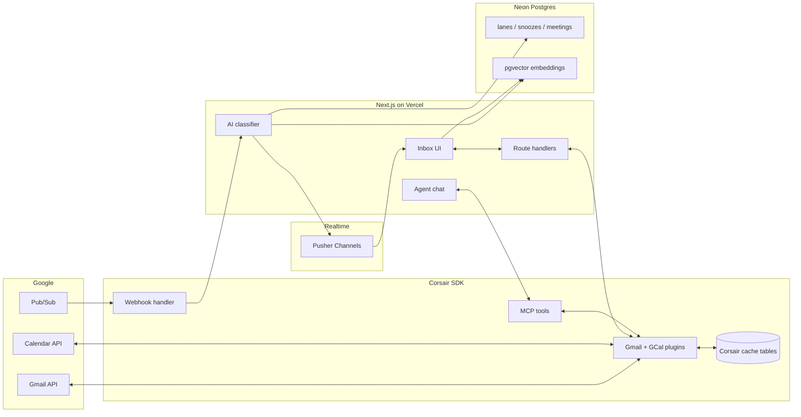

## High-level diagram



## Design principles

### Corsair cache first

Thread list reads and most inbox actions go through **Corsair's Postgres cache**, not live Gmail API calls on every keystroke. This keeps navigation snappy and reduces Google API quota usage.

Webhooks keep the cache fresh. When a new message arrives, Gmail push notifies Pub/Sub, Corsair verifies and processes the event, and the app re-classifies the affected thread.

### Server-only secrets

Environment validation lives in `src/lib/env.ts` with the `server-only` package. Client components must never import server env modules — use public env vars (`NEXT_PUBLIC_*`) or API routes instead.

### In-process MCP, not a separate server

The agent embeds Corsair MCP tools **in-process** via `@corsair-dev/mcp`. There is no standalone MCP HTTP server. Tools are built per-request for the authenticated user's tenant.

### OpenAI-first AI with fallback

Chat, classification, drafts, and embeddings use a **provider chain**: OpenAI first, Gemini on rate-limit or quota errors. Embeddings track `embedding_provider` per classification row so semantic search stays consistent when you switch providers.

## Primary data flows

### 1. Inbound email (webhook path)

```
Gmail INBOX change
  → Google Pub/Sub push
  → POST /api/webhooks?tenantId={userId}
  → Corsair processWebhook (signature verify)
  → handleGmailMessageChanged (async)
  → Fetch thread from Corsair cache
  → AI classify + embed
  → Upsert classifications row
  → Pusher event → browser refreshes lane
```

### 2. Inbox read (user opens app)

```
GET /inbox (RSC)
  → Session check
  → Query Corsair cache for thread list
  → Join classifications + snoozes + meetings
  → Render lanes with cached metadata
```

If backfill is incomplete, an activity banner shows progress while the latest 50 INBOX threads are classified.

### 3. Hero workflow (`M`)

```
User presses M
  → POST /api/inbox/meeting
  → Read scheduling intent from classification
  → Fetch calendar free/busy via Corsair GCal plugin
  → User picks slot in availability UI
  → Create calendar event + Meet link
  → Generate confirmation draft (AI or template fallback)
  → Store thread_meetings link
```

### 4. Semantic search (`/`)

```
User types query
  → POST /api/search { query, provider }
  → Embed query with selected provider
  → pgvector cosine search on classifications.embedding
  → Filter by userId + embedding_provider
  → Return ranked SearchHit[]
```

### 5. Agent chat

```
User sends message
  → POST /api/agent/chat (streaming)
  → buildAgentMcpTools(tenant)
  → Vercel AI SDK streamText with tools
  → run_script calls pause for approval (needsApproval: true)
  → User approves → tool executes → stream continues
```

## Security boundaries

| Layer | Mechanism |
|-------|-----------|
| User API routes | Better Auth session cookie |
| Inbox mutations | Session + Gmail/Calendar fully connected |
| Webhooks | Corsair `x-corsair-signature` verification |
| Cron | `Authorization: Bearer $CRON_SECRET` |
| OAuth tokens | Encrypted at rest by Corsair with `CORSAIR_KEK` |

## Deployment topology

| Component | Host |
|-----------|------|
| Next.js app | Vercel (`command-inbox.sayantanbal.in`) |
| Documentation | Vercel separate project (`docs.command-inbox.sayantanbal.in`) |
| Postgres + pgvector | Neon |
| Realtime | Pusher Channels |
| Scheduled jobs | cron-job.org → `/api/cron/process-due` |
| Gmail push | GCP Pub/Sub → production webhook URL |

See [Deploy to production](/docs/developer-guide/deploy-production) for step-by-step setup.
