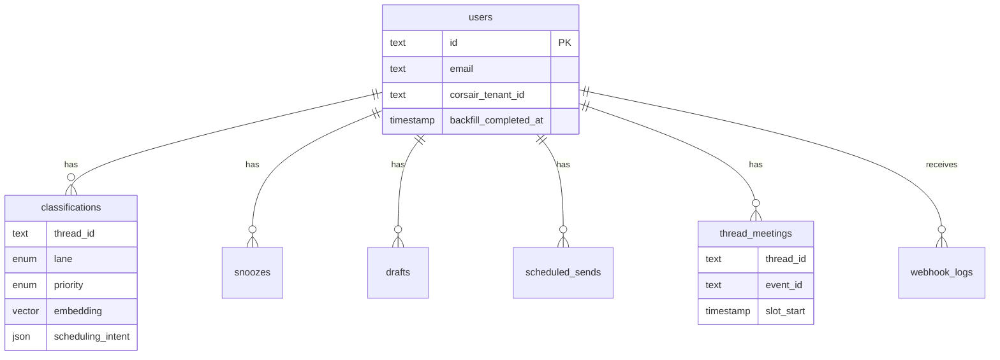

This page describes **application-owned tables** in plain language. For column-level detail, indexes, and enums, see [Database schema](/docs/reference/database-schema).

## Entity relationship

## Users

Each signed-in person maps 1:1 to a Corsair tenant. The `users` row stores:

- Better Auth user ID (primary key)
- Email and display name
- `corsair_tenant_id` after Google connect
- `backfill_completed_at` — when initial inbox classification finished

## Classifications

The heart of triage. One row per `(userId, threadId)` with:

- **Lane** — `reply`, `schedule`, `fyi`, or `done`
- **Priority** — `high`, `medium`, or `low`
- **Metadata** — subject, sender, snippet (denormalized for fast list rendering)
- **Scheduling intent** — JSON extracted by AI (proposed times, attendees, duration, confidence)
- **Embedding** — 768-dim pgvector for semantic search
- **Embedding provider** — `openai` or `gemini` (must match active provider for search)

Classifications are upserted on webhook events and during backfill.

## Snoozes

Temporary hiding of a thread until `snoozedUntil`. Expired snoozes are cleaned up by the cron job.

## Drafts

AI-generated or user-edited reply content, optionally tied to a thread. Used for confirmation drafts after meeting creation.

## Scheduled sends

Outbound email queue for send-later. Fields include recipients, subject, body, `sendAt`, and status (`pending`, `sent`, `cancelled`, `failed`). The cron route dispatches due rows via Corsair Gmail send.

## Thread meetings

Links a Gmail thread to a Google Calendar event:

- `eventId` — Google Calendar event ID
- `slotStart` — chosen meeting start time
- `durationMinutes` — meeting length

Enables reschedule (`PATCH /api/inbox/meeting`) and cancel (`DELETE`) without losing thread context.

## Webhook logs

Debug audit trail for inbound Corsair webhooks — payload, signature, verification result, and processing errors. Useful when Gmail push appears silent.

## Corsair cache (not app schema)

Corsair maintains its own Postgres tables for synced Gmail threads, messages, calendar events, and encrypted OAuth tokens. The app reads through the Corsair SDK rather than querying those tables directly.

Run `bun run corsair:setup` after migrations to initialize Corsair schema and integration keys.

## Related reference pages

- [Database schema](/docs/reference/database-schema) — full column definitions
- [API routes](/docs/reference/api-routes) — how rows are created and updated
- [Webhooks & realtime](/docs/developer-guide/webhooks-realtime) — classification pipeline
