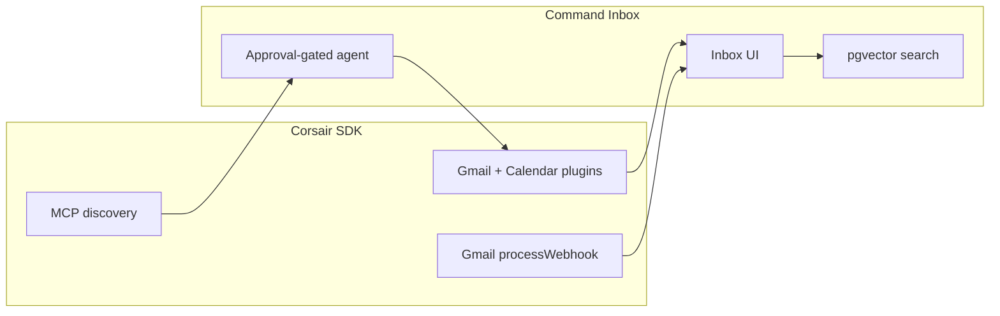

## Before you sign in

1. **Sign in** at [command-inbox.sayantanbal.in](https://command-inbox.sayantanbal.in) with **any Google account** once OAuth is published to Production. If the app is still in Testing mode, request access via [Judge access](/docs/overview/judge-access#request-oauth-access-judges).
2. Use a desktop browser first (Chrome or Edge). Mobile works — open the **menu** (☰) for Sent, Snoozed, and Archive.
3. **Fast path:** on the first onboarding screen (“When do you work?”), click **Skip to inbox** to use default 9–5 weekdays and jump straight to triage.
4. Prefer a **fully indexed** inbox for semantic search (`/`) — fresh accounts still get the last 50 threads classified immediately.

## Architecture (Corsair spine)

- **Gmail push** → Pub/Sub → `/api/webhooks` → Corsair `processWebhook` → AI lanes + Pusher
- **Calendar push** → `/api/webhooks/calendar` with channel-token verification
- **Reads/writes** → `tenant.gmail.api.*` / `tenant.googlecalendar.api.*` (Corsair-issued tokens)
- **google-proxy** — watches, attachments, attendee freeBusy where the SDK has no surface (still Corsair tokens, not raw OAuth in app code)
- **Agent** — MCP `list_operations` / `get_schema` for discovery; **typed tools** with approval for sends and invites (`run_script` intentionally disabled)
- **Cursor** — same tools via `bun mcp-server.ts` in the repo root

## 5-minute demo script

### 1. Triage loop (60s)

- Open **Inbox** → note **Reply / Schedule / FYI** lane tabs.
- Press **`j`** / **`k`** to move between threads.
- Press **`e`** to archive — watch the **undo toast** (5 seconds).
- Press **`/`** for semantic search over **indexed** mail (not entire mailbox history until background index completes).

### 2. Hero workflow — schedule a meeting (90s)

This is the headline feature:

1. Switch to the **Schedule** lane (or pick a scheduling thread).
2. Press **`M`** — inline availability appears beside the thread.
3. Pick a slot (busy attendee slots are grayed when Calendar free/busy is available).
4. Review the confirmation draft in the composer → send.
5. Optional: open **Calendar** tab (~3s) to see the new Meet event.

### 3. Command palette & deep links (45s)

- Press **`⌘K`** (or tap the floating command button on mobile).
- Type **sent**, **snooze**, or a **sender name** to jump.
- Open a shareable URL: `/inbox?thread=THREAD_ID&lane=schedule` — the thread opens directly.

### 4. Agent with approvals (60s)

- Open the **Agent** tab (mobile) or right panel (desktop).
- Try: *"Send a calendar invite to friend@corsair.dev at 9 AM next Thursday and email them to confirm."* (import **demo contacts** in onboarding if needed)
- Approve **`send_email`** and **`create_calendar_invite`** when prompted — nothing sends without your click.

### 5. Commitments & calendar (45s)

- **`G` then `T`** → Commitments (or **Waiting For** via palette).
- Open **Calendar** → create a focus block or run **defrag** on a busy day.

## What to look for (scoring hints)

| Signal | Where |
|--------|--------|
| Corsair SDK reads/writes Gmail + Calendar | Archive, send, `M` flow, agent tools |
| Typed MCP tools + approval gates | Agent chat — no silent sends |
| AI triage quality | Lane tabs after connect (banner if AI keys missing) |
| Keyboard density | `j/k/e/r/m/s`, G-chords, `⌘K` palette |
| Production polish | Undo, realtime lane updates, mobile drawer |

## Visual assets

Screenshots and hero GIF paths (drop files before final submission):

- `/demo/hero.gif` — ≤ 90s `M` workflow loop
- `/demo/inbox-triage.png` — lane + list
- `/demo/agent-approval.png` — approval UI
- `/demo/mobile-drawer.png` — mobile mailboxes

See `public/demo/README.md` in the repo for the recording checklist.

## Troubleshooting

| Issue | Fix |
|-------|-----|
| "Access blocked" on Google sign-in | OAuth not published, or email not in test users |
| Empty semantic search | Wait for indexing banner to clear, or use advanced search (`Mod+Shift+F`) |
| Dumb lanes / orange banner | Add OpenAI or Gemini key in Settings → AI |
| Agent won't send | Approve the tool card; check AI keys in Settings |
| Calendar webhooks 503 | Team must set HTTPS `APP_URL` and renew watches |

## Links

- [Features](/docs/overview/features)
- [Keyboard shortcuts](/docs/reference/keyboard-shortcuts)
- [Corsair MCP tools](/docs/reference/corsair-mcp-tools)
- [Judge OAuth access](/docs/overview/judge-access)
