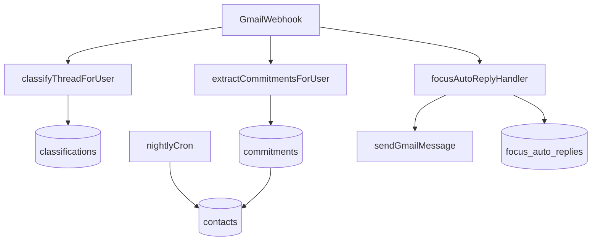
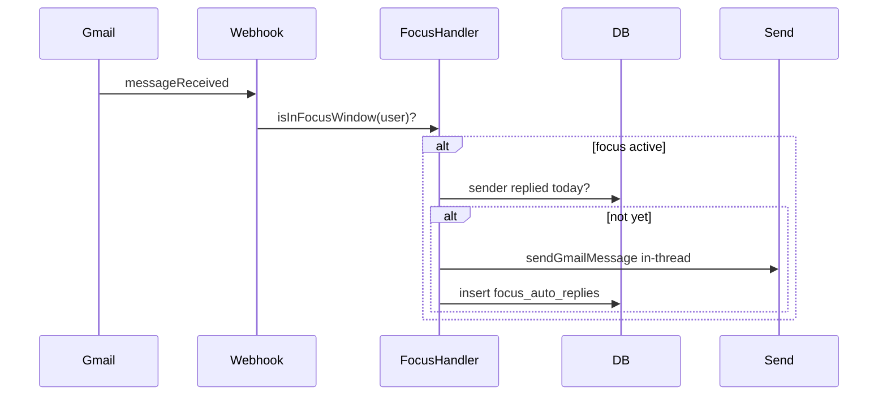

# Actionable Inbox — Product & Engineering Plan

Status: **In progress**  
Last updated: **2026-06-14**

Single source of truth for the pivot from "meeting pipeline" to **actionable email**.  
Supersedes scheduling-only positioning on the homepage and in launch copy.

---

## Executive summary

| | |
|---|---|
| **Thesis** | Superhuman makes you faster at email. Command Inbox makes your email actually work for you. |
| **Hero headline** | *Your inbox is your todo list, whether you like it or not.* |
| **Target** | Freelancers, consultants, indie hackers |
| **Price** | $15/mo (vs Superhuman $30) |
| **Launch gate** | All 7 differentiator features live before public repositioning |
| **Do NOT build** | Multi-account, async video, gamification, AI tone sliders |

---

## Locked product decisions

| Decision | Choice |
|----------|--------|
| Positioning | Full pivot — actionable email hero; `M` scheduling moves to second section |
| Commitment extraction | Separate AI pass on every Gmail webhook, parallel to classifier |
| Low confidence (<0.6) | "Possible commitment?" chip on thread — confirm/dismiss before entering views |
| Auto follow-up | 5 business days silence on Waiting For → AI draft queued, **never auto-send** |
| Relationship scope | Top 50 contacts by email volume (90d), rebuilt nightly |
| Focus Mode auto-reply | **Option 2:** one-time auto-reply email per sender during focus windows via `sendGmailMessage` — not native Gmail vacation API |
| Thread → Action | Linear only at launch; Notion/GitHub "coming soon" in UI + homepage demo |
| Snippets | `//` trigger + user CRUD + 5 seeded templates |
| Send-time optimization | Per-counterparty reply patterns when ≥5 exchanges; business-hours fallback |
| Homepage demo | Fully client-side mock — working keyboard shortcuts, no auth |
| Pricing on homepage | Show **$15/mo** with Superhuman $30 comparison |

---

## Architecture

**Hook:** `src/lib/webhooks/gmail-event.ts` — after `classifyThreadForUser`, run commitment extraction and focus auto-reply.

**Reuse:**
- Classifier: `src/lib/classifier/persist.ts`, `src/lib/schemas/domain.ts`
- AI JSON: `src/lib/ai/generate.ts`
- Daily brief: `src/lib/ai/daily-brief.ts`
- Focus blocks: `src/app/api/inbox/focus-block/route.ts`
- Send later: `scheduledSends` + `/api/cron/process-due`
- Shortcuts: `src/lib/shortcuts.ts`

---

## Database schema

Migration: `drizzle/0009_actionable_inbox.sql`

### `commitments`
| Column | Type | Notes |
|--------|------|-------|
| id | text PK | |
| user_id | text FK | |
| thread_id | text | |
| message_id | text | |
| direction | enum | `outbound` \| `inbound` |
| text | text | Commitment summary |
| due_date | timestamptz | nullable |
| counterparty_email | text | |
| status | enum | `pending_confirm` \| `open` \| `fulfilled` \| `dismissed` |
| confidence | real | 0–1 |
| extracted_at | timestamptz | |

### `contacts`
Nightly rollup — top 50 by volume (90d).

| Column | Type |
|--------|------|
| user_id, email | composite unique |
| display_name | text |
| last_contact_at | timestamptz |
| avg_response_hours | real |
| email_count_30d | integer |
| warmth | enum: `cold` \| `warm` \| `active` \| `new` |
| open_commitment_count | integer |

### `email_snippets`
user_id, name, body, variables (json string[])

### `user_preferences`
batch_windows (json), focus_mode_enabled, auto_responder_template, follow_up_days_default (default 5)

### `external_connections`
provider (`linear`), access_token (encrypted), team_id, default_project_id

### `thread_external_tasks`
thread_id, provider, external_task_id, url

### `focus_auto_replies`
Dedup: one reply per sender per calendar day during active focus.

### `meeting_briefs`
Cache per (user_id, attendee_email, brief_date)

---

## Feature specs & acceptance criteria

### 1. Commitment Tracker

- **Commitments view:** things you promised, grouped by due date
- **Waiting For (`W`):** things others promised you
- **Extraction:** `src/lib/commitments/extract.ts` on every Gmail webhook
- **Confidence:** ≥0.6 → `open`; <0.6 → `pending_confirm` + thread chip
- **Follow-up:** 5 business days silence → draft in composer (review required)
- **APIs:** `GET/POST/PATCH /api/inbox/commitments`
- **Acceptance:** User can confirm/dismiss possible commitments; Waiting For lists inbound open items; follow-up draft appears after cron

### 2. Meeting Pre-Brief (`B`)

- Trigger: next event within 2h or `B` on thread
- Content: last 3 threads, open commitments, attachments note, tone one-liner
- API: `GET /api/inbox/pre-brief`
- **Acceptance:** Brief panel renders cached or fresh brief for attendee

### 3. Relationship Health (`/people`)

- Top 50 contacts, warmth indicator, open commitments
- Cold alert: no reply 21d + high-priority inbound
- Nightly cron rebuild
- **Acceptance:** `/people` shows ranked contacts; daily brief includes cold-contact alerts

### 4. Focus Mode + Batching

- Batch windows: 9am / 1pm / 5pm (customizable)
- During focus: suppress Pusher toasts, calendar focus blocks
- **Option 2 auto-reply:** inbound during focus → one in-thread reply per sender/day via `sendGmailMessage`
- Default template: *"I check email at 9am, 1pm, and 5pm. I'll get back to you soon."*
- **Acceptance:** Second email same day from same sender gets no auto-reply; template editable

### 5. Thread → Action (`T`)

- Linear OAuth + create issue modal with AI pre-fill
- Notion/GitHub disabled with "Coming soon"
- **Acceptance:** Issue created in Linear; link stored on thread

### 6. Smart Snippets (`//`)

- Fuzzy picker in composer; variables `{{first_name}}`, `{{project_name}}`
- 5 seeds: Follow-up, Intro, Invoice, Scheduling, OOO
- **Acceptance:** `//` opens picker; variables resolve from thread

### 7. Send-Time Optimization

- Histogram per counterparty (≥5 exchanges)
- Suggest slot in send-later UI with tooltip
- Fallback: next business day 9am local
- **Acceptance:** Composer shows suggested send time with explanation

---

## Focus Mode Option 2 — auto-reply flow

---

## Homepage showcase

**Hero:** actionable email thesis + $15/mo  
**Component:** `src/components/home/feature-showcase.tsx` — 7 tabs, client mock, working shortcuts  
**Keep:** dark `M` scheduling section (second story)

| Tab | Interaction |
|-----|-------------|
| Commitments | `W` → Waiting For list; queue follow-up |
| Pre-Brief | `B` → brief panel |
| People | Warmth dots; click contact |
| Focus | Toggle batch windows |
| Export | `T` → Linear modal |
| Snippets | `//follow` in mini composer |
| Send time | Optimal slot highlighted |

---

## Implementation phases

| Phase | Scope | Est. days |
|-------|-------|-----------|
| 0 | Schema, Zod, webhook hook | 4 |
| 1 | Commitment Tracker | 6 |
| 2 | Meeting Pre-Brief | 4 |
| 3 | Relationship Health | 5 |
| 4 | Focus Mode + auto-reply | 6 |
| 5 | Linear export | 4 |
| 6 | Snippets | 3 |
| 7 | Send-time optimization | 3 |
| 8 | Homepage pivot | 4 |

---

## New shortcuts

| Key | Action | Context |
|-----|--------|---------|
| `W` | Open Waiting For | global |
| `B` | Meeting pre-brief | thread |
| `T` | Export to Linear | thread |
| `F` | Fulfill commitment | thread |

---

## Testing & launch checklist

- [ ] Zod unit tests: commitment schema, snippet variables, send-time suggest
- [ ] API smoke: commitments CRUD
- [ ] Manual QA: focus auto-reply dedup (same sender, same day = one reply)
- [ ] All 7 features verified in production
- [ ] Update `docs/whats-done.md` and `docs/social-post.md`

---

## Risks

| Risk | Mitigation |
|------|------------|
| Auto-reply spammy | One per sender/day; editable template; opt-out |
| LLM cost | Last message only; skip FYI/done lanes |
| Linear OAuth | Document env vars in `docs/deploy.md` |
| Scope | Strict phase order |

---

## Related docs

- [What's done](./whats-done.md)
- [Product plan (hackathon)](../.cursor/plans/command_inbox_product_plan_7b9adbaf.plan.md)
- [Deploy guide](./deploy.md)
- [Social post draft](./social-post.md)
